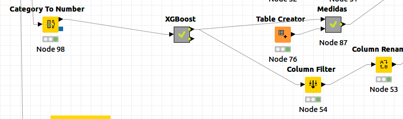
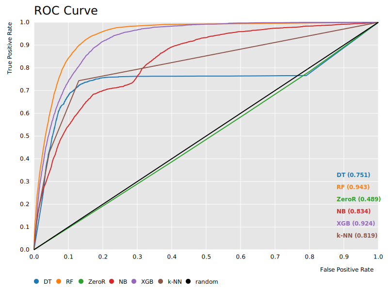
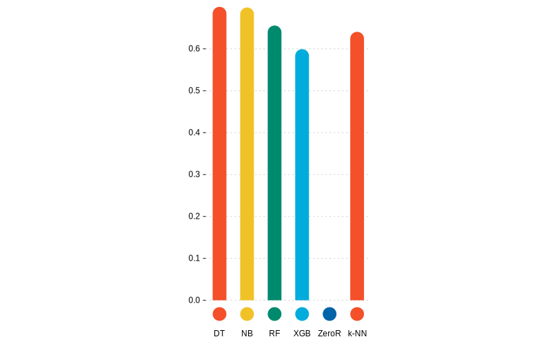
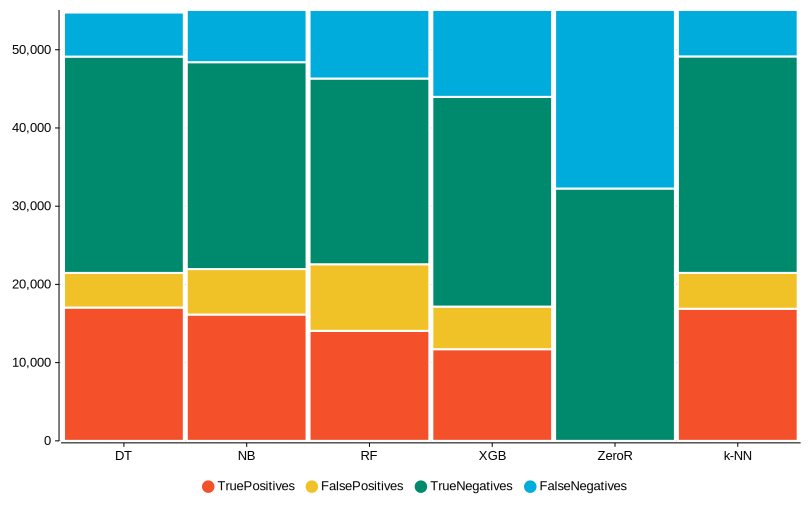
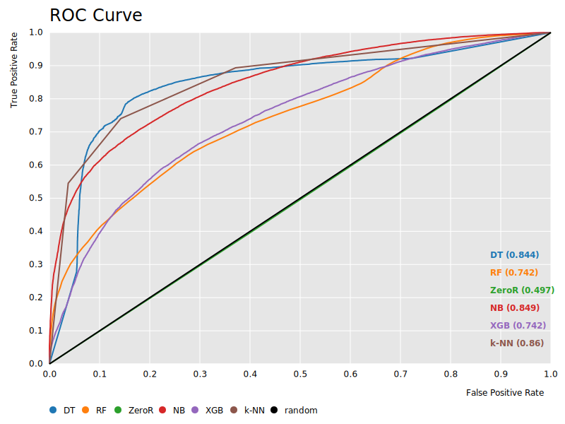
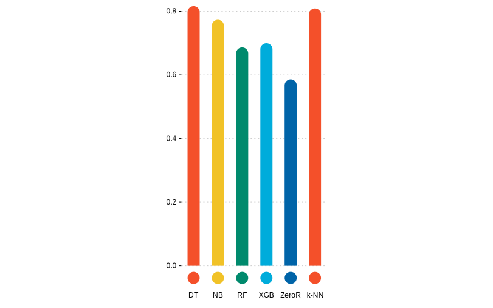
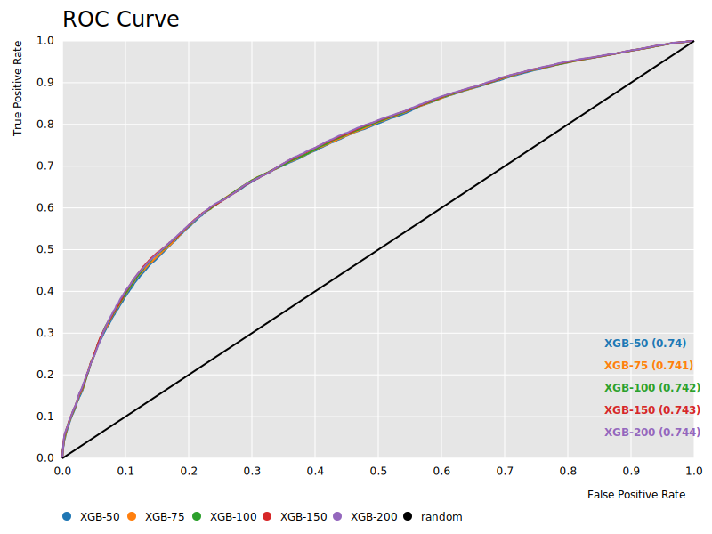
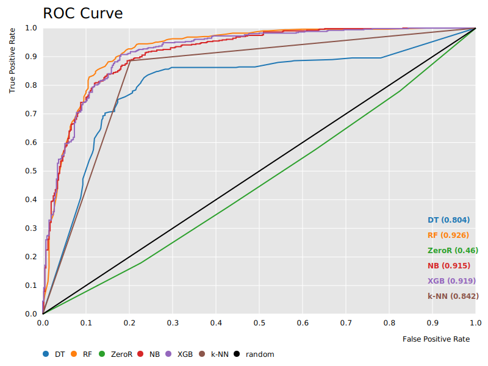

# Práctica 1: Análisis predictivo mediante clasificación

> Ana Buendía Ruiz-Azuaga

## Índice

- [Práctica 1: Análisis predictivo mediante clasificación](#práctica-1-análisis-predictivo-mediante-clasificación)
  - [Índice](#índice)
  - [Introducción](#introducción)
    - [Heart](#heart)
    - [Mobile Price](#mobile-price)
    - [Bank](#bank)
    - [Tanzania](#tanzania)
  - [Resultados obtenidos](#resultados-obtenidos)
    - [ZeroR](#zeror)
    - [Árboles de decisión (DT)](#árboles-de-decisión-dt)
    - [Random Forest (RF)](#random-forest-rf)
    - [Naive Bayes (NB)](#naive-bayes-nb)
    - [XGBoost (XGB)](#xgboost-xgb)
    - [k-NN (k-NN)](#k-nn-k-nn)
  - [Análisis de resultados](#análisis-de-resultados)
  - [Configuración de algoritmos](#configuración-de-algoritmos)
  - [Procesado de datos](#procesado-de-datos)
  - [Interpretación de resultados](#interpretación-de-resultados)
  - [Contenido adicional](#contenido-adicional)
  - [Bibliografía](#bibliografía)

## Introducción

En esta práctica se trabajará en cuatro problemas de clasificación reales mediante diversos algoritmos de clasificación supervisada implementados en knime, con el objetivo de obtener una predicción y analizar la calidad de esta comparándola con predicciones de otros algoritmos en el mismo problema.

Ahora estudiaremos las particularidades de cada problema por separado:

### Heart 

El objetivo de este problema consiste en intentar predecir si se tiene o no una enfermedad cardíaca.

Para ello, se nos proporciona un conjunto de datos con 918 instancias, de las cuales se nos da información respecto a 11 variables o atributos, y su clase a la que pertencen.

Comenzamos analizando los datos del problema, lo primero en lo que nos fijamos es en que la mayoría ed variables son numéricas, y algunos atributos están marcados con enteros usando 0 o 1 para señalar si una persona posee una característica o no. En el atributo colesterol, cabe destacar que se va a interpretar el valor 0 como valor perdido.

Representamos los datos usando una pie chart para comprobar si las clases están balanceadas o no.

Observamos que las clases están más o menos igualadas, pero no terminan de estar balanceadas.

Se ha considerado como la clase positiva el valor 1, indicando que se tiene una enfermedad cardíaca.

### Mobile Price

Este problema consiste en intentar predecir a qué rango de precio pertenece un teléfono móvil, donde hay cuatro posibles rangos.

Para ello, se nos proporciona un conjunto de datos con 2000 instancias, de las cuales se nos da información respecto a 20 variables o atributos, y su clase a la que pertencen.

Comenzamos analizando los datos del problema, lo primero en lo que nos fijamos es en que la mayoría ed variables son numéricas, y algunos atributos están marcados con enteros usando 0 o 1 para señalar si un teléfono posee o no una carcaterística, por ejemplo, si es azul o no, o si tiene 4G o no.

Representamos los datos usando una pie chart para comprobar si las clases están balanceadas o no.

Observamos que las 4 clases están igualmente representadas, por lo que el conjunto de datos está balanceado.

Finalmente comprobamos al leer el archivo de datos que el problema no tiene missing values, es decir, no hay ningún atributo que sea desconocido para alguna de las instancias.

Se ha considerado como la clase positiva el rango 0 de precio, aunque se podría haber seleccionado cualquier otro.

### Bank

El objetivo de este problema es realizar predicciones sobre si va a aceptarse un depósito en un banco o no basándose en diversos factores.

Para este propósito se nos proporciona un fichero de datos que consta de 41188 instancias, de las cuales conocemos 20 atributos y la clase a la que pertencen, que será sí o no.

Analizamos ahora los datos que nos han proporcionado del problema, al contrario que en el problema de los móviles, aquí podemos observar que hay variables nominales.

Usamos una pie chart para ver a simple vista si los datos están balanceados.

Observamos que los datos están bastante desbalanceados, lo que puede afectar al rendimiento de algunos algoritmos que sean sensibles a ello.

Para terminar el análisis inicial abrimos el archivo de datos y comprobamos que hay missing values, ya que hay atributos que en ocasiones toman un valor "unknown" o "nonexistent", indicando así que son valores desconocidos o perdidos.

Se ha considerado como la clase positiva "yes", ya que queremos predecir cuándo se va a conceder un crédito.

### Tanzania

Este problema consiste en tratar de realizar predicciones sobre qué bombas de agua en Tanzania no funcionan para cambiarlas o repararlas.

Para ello, contamos con un conjunto de datos que consta de 55083 instancias, de las cuales conocemos 39 atributos y la clase a la que pertencen, que podrá tomar valores "funcional" o "no funcional".

Analizamos ahora los datos que nos han proporcionado del problema, de nuevo en este conjunto de datos tenemos atributos nominales a la vez que atributos numéricos.

Usamos una pie chart para ver a simple vista si los datos están balanceados.

Observamos que los datos están bastante desbalanceados, lo que puede afectar al rendimiento de algunos algoritmos que sean sensibles a ello.

Finalmente abrimos el archivo de datos y comprobamos que hay missing values, ya que hay atributos que en ocasiones toman un valor "unknown" o "nonexistent", o en algunos numéricos se ha consdierado el valor "0" como desconocido, indicando así que son valores desconocidos o perdidos.

Se ha considerado como la clase positiva "non functional", ya que queremos predecir cuándo se necesita reparar una bomba de agua.

## Resultados obtenidos

### ZeroR

Para comenzar, aunque no se ha considerado este algoritmo como uno de los cinco a estudiar durante la práctica, se ha implementado el algoritmo ZeroR como referencia para los demás algoritmos.

El algoritmo ZeroR predice siempre que cualquier instancia pertenece a la clase mayoritaria, por lo tanto no resulta muy útil, pero proporciona una cota inferior al resto de algoritmos, esto es, cualquier algoritmo nos debería proporcionar un valor mayor en las medidas al que nos proporciona ZeroR.

A continuación tenemos la tabla con las medidas obtenidas por este algoritmo en cada dataset:

En la siguiente tabla se muestran las medidas tomadas:

| RowID    | TP   | FP   | TN    | FN    | Precision | Sensitivity | Specificity | F-measure | Accuracy | Cohen's kappa | Gmean  | AUC    |
| -------- | ---- | ---- | ----- | ----- | --------- | ----------- | ----------- | --------- | -------- | ------------- | ------ | ------ |
| Heart    | 508  | 410  | 0     | 0     | 0,5534    | 1,0000      | 0,0000      | 0,7125    | 0,5534   | 0,0000        | 0,0000 | 0,4819 |
| Mobile   | 188  | 612  | 888   | 312   | 0,2350    | 0,3760      | 0,5920      | 0,2892    | 0,2330   | \-0,0227      | 0,4718 | 0,4787 |
| Bank     | 0    | 0    | 36548 | 4640  |           | 0,0000      | 1,0000      |           | 0,8873   | 0,0000        | 0,0000 | 0,4892 |
| Tanzania | 0    | 0    | 32259 | 22824 |           | 0,0000      | 1,0000      |           | 0,5856   | 0,0000        | 0,0000 | 0,4974 |

Como se puede observar el algoritmo no da buenos resultados, pero como comentamos antes solo lo usaremos para tener una cota inferior en las medidas de los demás algoritmos.

También llama la atención que hay valores que no han podido calcularse en la tabla, ya que como este algoritmo siempre asigna como predicción la clase mayoritaria, algunas medidas no pueden calcularse, pues requerirían dividir por cero.

### Árboles de decisión (DT)

El primer algoritmo seleccionado son árboles de decisión, estos parten de los ejemplos en el conjunto de entrenamiento para construir un árbol seleccionando atributos con el objetivo de dividir los ejemplos en función de los valores de estos.

Como criterio de selección se ha usado el índice Gini, este índice mide con qué frecuencia si escogemos aleatoriamente un ejemplo del conjunto de datos este sería etiquetado de manera incorrecta según la distribución de clases del subconjunto.

Sea $p_i$  la frecuencia relativa de la clase $i$ en un conjunto de datos $T$, que contiene ejemplos de $n$ clases, entonces se define:
$$\displaystyle\text{gini}(T)=1-\sum_{i=1}^{n}p_i^2$$

| RowID    | TP    | FP   | TN    | FN   | Precision | Sensitivity | Specificity | F-measure | Accuracy | Cohen's kappa | Gmean  | AUC    | Complejidad |
| -------- | ----- | ---- | ----- | ---- | --------- | ----------- | ----------- | --------- | -------- | ------------- | ------ | ------ | ----------- |
| Heart    | 417   | 87   | 323   | 90   | 0,8274    | 0,8225      | 0,7878      | 0,8249    | 0,8070   | 0,6099        | 0,8050 | 0,8086 | 69          |
| Mobile   | 452   | 40   | 1460  | 48   | 0,9187    | 0,9040      | 0,9733      | 0,9113    | 0,8455   | 0,7940        | 0,9380 | 0,9591 | 109         |
| Bank     | 2321  | 1973 | 34365 | 2158 | 0,5405    | 0,5182      | 0,9457      | 0,5291    | 0,8988   | 0,4725        | 0,7000 | 0,7508 | 2689        |
| Tanzania | 17045 | 4426 | 27655 | 5631 | 0,7939    | 0,7517      | 0,8620      | 0,7722    | 0,8163   | 0,6185        | 0,8050 | 0,8444 | 5042        |

Observamos que funcionó mejor en el dataset e los móviles, y peor en el del banco, aún así ha dado muy buenos resultados en todos los conjuntos de datos, ya que los árboles de decisión trabajan con cualquier valor de datos y gestionan bien los valores perdidos.

En este algoritmo la complejidad se corresponde con el número de hojas que tiene el árbol generado. Para calcular el número de hojas se ha empleado el siguiente workflow:

Para calcular el número de hojas se transforma el árbol obtenido en un conjunto de reglas y con el nodo Statistics se comprueba el parámetro "row count", que cuenta el número de filas, que coincide con las reglas y por tanto con las hojas.

### Random Forest (RF)

También hemos elegido el algoritmo random forest, que combina varios árboles de decisión simples para mejorar su predicción. Cada clasificador funciona independientemente de los demás, de forma que se mejora la inestabilidad de los algoritmos frente a pequeños cambios en el conjunto de datos de entrenamiento.

Se usarán 100 clasificadores que usan el índice Gini para seleccionar los atributos con los que dividir el árbol.

En algunos problemas, como en el de Tanzania, ha sido necesario usar el nodo domain calculator para que tuviera en cuenta todos los valores posibles de los atributos.

Veamos la tabla con las medidas tomadas en cada conjunto de datos:

| RowID    | TP    | FP   | TN    | FN   | Precision | Sensitivity | Specificity | F-measure | Accuracy | Cohen's kappa | Gmean  | AUC    | Complejidad |
| -------- | ----- | ---- | ----- | ---- | --------- | ----------- | ----------- | --------- | -------- | ------------- | ------ | ------ | ----------- |
| Heart    | 455   | 71   | 339   | 53   | 0,8650    | 0,8957      | 0,8268      | 0,8801    | 0,8649   | 0,7256        | 0,8606 | 0,9225 | 100         |
| Mobile   | 471   | 43   | 1457  | 29   | 0,9163    | 0,9420      | 0,9713      | 0,9290    | 0,8785   | 0,8380        | 0,9566 | 0,9947 | 100         |
| Bank     | 2048  | 980  | 35568 | 2592 | 0,6764    | 0,4414      | 0,9732      | 0,5342    | 0,9133   | 0,4887        | 0,6554 | 0,9428 | 100         |
| Tanzania | 14060 | 8517 | 23742 | 8764 | 0,6228    | 0,6160      | 0,7360      | 0,6194    | 0,6863   | 0,3526        | 0,6733 | 0,7418 | 100         |

Podemos observar que Random Forest obtiene resultados muy buenos en todos los datos, aunque su valor más bajo sn duda está en el problema de Tanzania. En tres de los cuatro problemas a estudiar se ve que random forest es el que mejores resultados obtiene. 

En este algoritmo se considera la complejidad como el número de modelos a generar.

### Naive Bayes (NB)

Este algoritmo es el más simple de los métodos bayesianos. Se asume que todos sus atributos son independientes y calcula cuál es la clase más probable dado un valor del resto de atributos.

Para este algoritmo no ha sido necesario realizar preprocesamiento, ya que aunque obtenemos un warning, el algoritmo puede trabajar con valores perdidos.

Veamos ahora las medidas tomadas con este algoritmo:

| RowID    | TP    | FP   | TN    | FN   | Precision | Sensitivity | Specificity | F-measure | Accuracy | Cohen's kappa | Gmean  | AUC    | Complejidad |
| -------- | ----- | ---- | ----- | ---- | --------- | ----------- | ----------- | --------- | -------- | ------------- | ------ | ------ | ----------- |
| Heart    | 436   | 75   | 335   | 72   | 0,8532    | 0,8583      | 0,8171      | 0,8557    | 0,8399   | 0,6758        | 0,8374 | 0,9152 | 22          |
| Mobile   | 436   | 67   | 1433  | 64   | 0,8668    | 0,8720      | 0,9553      | 0,8694    | 0,7890   | 0,7187        | 0,9127 | 0,9796 | 80          |
| Bank     | 2511  | 3594 | 32954 | 2129 | 0,4113    | 0,5412      | 0,9017      | 0,4674    | 0,8611   | 0,3892        | 0,6985 | 0,8336 | 40          |
| Tanzania | 16149 | 5813 | 26446 | 6675 | 0,7353    | 0,7075      | 0,8198      | 0,7212    | 0,7733   | 0,5303        | 0,7616 | 0,8489 | 117         |

Se observa que proporciona predicciones bastante buenas, en especial en los problemas con datos numéricos.

En Naive bayes la complejidad se corresponde con el número de clases multiplicada por el número de atributos que se tienen de cada instancia.

### XGBoost (XGB)

XGBoosting es una algoritmo "ensemble" basado en árboles de decisión que usa "gradient boosting".

Se ha escogido este algoritmo ya que se ha considerado que puede competir en medidas con el random forest.

Aunque XGBoosting no requiere de un preprocesamiento de los missing values, sí ha sido necesario convertir todos los atributos a numéricos.

TODO CAMBIAR ESTA CAPTURA

Las medidas obtenidas para este algoritmo en los distintos problemas son:

| RowID    | TP    | FP   | TN    | FN    | Precision | Sensitivity | Specificity | F-measure | Accuracy | Cohen's kappa | Gmean  | AUC    | Complejidad |
| -------- | ----- | ---- | ----- | ----- | --------- | ----------- | ----------- | --------- | -------- | ------------- | ------ | ------ | ----------- |
| Heart    | 449   | 71   | 339   | 59    | 0,8635    | 0,8839      | 0,8268      | 0,8735    | 0,8584   | 0,7127        | 0,8549 | 0,9241 | 100         |
| Mobile   | 450   | 55   | 1445  | 50    | 0,8911    | 0,9000      | 0,9633      | 0,8955    | 0,7555   | 0,6740        | 0,9311 | 0,9863 | 100         |
| Bank     | 1709  | 935  | 35613 | 2931  | 0,6464    | 0,3683      | 0,9744      | 0,4692    | 0,9061   | 0,4220        | 0,5991 | 0,9239 | 100         |
| Tanzania | 11718 | 5447 | 26812 | 11106 | 0,6827    | 0,5134      | 0,8311      | 0,5861    | 0,6995   | 0,3575        | 0,6532 | 0,7422 | 100         |

Al contrario que en el algoritmo anterior, XGBoosting obtiene mejores resultados en los problemas con datos numéricos, ya que los nominales o categóricos han sido transformados a atributos numéricos.

Para XGBoost la complejidad es el número de rondas de boost.

### k-NN (k-NN)

El algoritmo k-NN predice las clases calculando cuáles son los $k$ vecinos más cercanos al ejemplo dado y asigna la clase mayoritaria entre ellos. Para calcular qué ejemplos son "más cercanos" se usa la distancia euclídea entre los atributos, aunque en ocasiones puede usarse otra distancia.

Como preprocesamiento mínimo han tenido que tratarse los valores perdidos o missing values, además de, como el algoritmo trabaja con distancias euclídeas, convertir todas las variables a variables numéricas. Y, finalmente, con el fin de no dar más peso a unos valores numéricos que a otros se ha normalizado.

El algoritmo se ha implementado considerando $k=3$.

Las distintas medidas obtenidas para k-NN son:

| RowID    | TP    | FP   | TN    | FN   | Precision | Sensitivity | Specificity | F-measure | Accuracy | Cohen's kappa | Gmean  | AUC    | Complejidad |
| -------- | ----- | ---- | ----- | ---- | --------- | ----------- | ----------- | --------- | -------- | ------------- | ------ | ------ | ----------- |
| Heart    | 450   | 86   | 324   | 58   | 0,8396    | 0,8858      | 0,7902      | 0,8621    | 0,8431   | 0,6806        | 0,8367 | 0,8380 | 735         |
| Mobile   | 300   | 187  | 1313  | 200  | 0,6160    | 0,6000      | 0,8753      | 0,6079    | 0,4765   | 0,3020        | 0,7247 | 0,8432 | 1600        |
| Bank     | 1992  | 1638 | 34910 | 2648 | 0,5488    | 0,4293      | 0,9552      | 0,4817    | 0,8959   | 0,4249        | 0,6404 | 0,8191 | 32951       |
| Tanzania | 16889 | 4585 | 27674 | 5935 | 0,7865    | 0,7400      | 0,8579      | 0,7625    | 0,8090   | 0,6031        | 0,7967 | 0,8599 | 44067       |

En general, funciona bien, no se ve tanta disparidad entre el dataset para el que mejor funciona y para el que peor. 

En este algoritmo la complejidad es el conjunto de instancias de los datos de entrenamiento.

## Análisis de resultados

Para analizar correctamente los resultados obtenidos, realizaremos el análisis individualmente para cada conjunto de datos que se ha trabajado.

Realizaremos un análisis centrado en comparar los distintos algoritmos usados en cada problema, tratando de buscar motivos a por qué unos mejoran mejor que otros y finalmente extraer conclusiones.

### Heart

Para comenzar, analizamos el problema sobre enfermedades del corazón. En la siguiente tabla se pueden ver las medidas obtenidas por los diferentes algoritmos en este problema.

| RowID | TP   | FP   | TN   | FN   | Precision | Sensitivity | Specificity | F-measure | Accuracy | Cohen's kappa | Gmean  | AUC    |
| ----- | ---- | ---- | ---- | ---- | --------- | ----------- | ----------- | --------- | -------- | ------------- | ------ | ------ |
| DT    | 417  | 87   | 323  | 90   | 0,8274    | 0,8225      | 0,7878      | 0,8249    | 0,8070   | 0,6099        | 0,8050 | 0,8086 |
| RF    | 455  | 71   | 339  | 53   | 0,8650    | 0,8957      | 0,8268      | 0,8801    | 0,8649   | 0,7256        | 0,8606 | 0,9225 |
| ZeroR | 508  | 410  | 0    | 0    | 0,5534    | 1,0000      | 0,0000      | 0,7125    | 0,5534   | 0,0000        | 0,0000 | 0,4819 |
| NB    | 436  | 75   | 335  | 72   | 0,8532    | 0,8583      | 0,8171      | 0,8557    | 0,8399   | 0,6758        | 0,8374 | 0,9152 |
| XGB   | 449  | 71   | 339  | 59   | 0,8635    | 0,8839      | 0,8268      | 0,8735    | 0,8584   | 0,7127        | 0,8549 | 0,9241 |
| k-NN  | 450  | 86   | 324  | 58   | 0,8396    | 0,8858      | 0,7902      | 0,8621    | 0,8431   | 0,6806        | 0,8367 | 0,8380 |

Para facilitar la lectura de estos datos, vamos a representar en un gráfico de barras apilado los valores de la matriz de confusión.

En esta gráfica se puede ver que el algoritmo con mayor número de verdaderos positivos es Random Forest. Además, tiene un número bastante bajo de falsos positivos, por lo que a primera vista, lo consideraríamos el mejor algroitmo para este dataset.

En general, se observa que todos los algoritmos realizan predicciones bastante buenas, aunque el peor es árboles de decisión. Aún así, todos los algoritmos parecen bastante igualados en los resultados de la matriz de confusión.

Los algoritmos basados en árboles y naive bayes, al poder trabajar con variables tanto categóricas como numéricas, no parece afectarles mucho que todos los valores sean numéricos, lo que por otro lado claramente beneficia a XGBoost y k-NN, que solo trabajan con este tipo de atributos.

Veamos ahora la curva ROC:

En esta curva de nuevo se aprecia que el algoritmoXGBoost es el mejor, seguido de cerca por Random forest, y después, con mayor diferencia, Naive Bayes y k-NN.

También cabe destacar que en esta gráfica se aprecia como el algoritmo de árboles de decisión es el peor de nuevo, y como el algoritmo ZeroR es ligeramente peor que un selector aleatorio.

Representamos también la precisión de cada algoritmo:

Se observa que todos los algoritmos (salvo ZeroR) tienen precisión mayor a 0.8.

En este problema hemos notado que Naive bayes funciona bastante bien, como ya se mencionó en la seccióna nterior, este algoritmo asume que todos los atributos son independientes entre sí. Para comprobar si esta asunción es cierta, hemos representado como un heatmap la matriz de correlación.

Se puede ver que la correación entre atributos es nula o muy baja, por lo tanto la asunción de que los atributos son independientes no afecta demasiado negativamente.

Finalmente, se hará un ránking de los algoritmos en función de G-mean. Para hacer la comparación más sencilla, se realizará un gráfico de barras igual que el de la precisión.

En conclusión, el ránking es, de mejor a peor:

- Random forest.
- XGBoost.
- Naive bayes.
- k-NN
- Decission tree.

### Mobile

Analizamos ahora el conjunto de datos sobre estimaciones de precios de móviles según sus características. De nuevo, hemos tomado medidas con los distintos algoritmos:

| RowID | TP   | FP   | TN   | FN   | Precision | Sensitivity | Specificity | F-measure | Accuracy | Cohen's kappa | Gmean  | AUC    |
| ----- | ---- | ---- | ---- | ---- | --------- | ----------- | ----------- | --------- | -------- | ------------- | ------ | ------ |
| DT    | 452  | 40   | 1460 | 48   | 0,9187    | 0,9040      | 0,9733      | 0,9113    | 0,8455   | 0,7940        | 0,9380 | 0,9591 |
| RF    | 471  | 43   | 1457 | 29   | 0,9163    | 0,9420      | 0,9713      | 0,9290    | 0,8785   | 0,8380        | 0,9566 | 0,9947 |
| ZeroR | 188  | 612  | 888  | 312  | 0,2350    | 0,3760      | 0,5920      | 0,2892    | 0,2330   | \-0,0227      | 0,4718 | 0,4787 |
| NB    | 436  | 67   | 1433 | 64   | 0,8668    | 0,8720      | 0,9553      | 0,8694    | 0,7890   | 0,7187        | 0,9127 | 0,9796 |
| XGB   | 450  | 55   | 1445 | 50   | 0,8911    | 0,9000      | 0,9633      | 0,8955    | 0,7555   | 0,6740        | 0,9311 | 0,9863 |
| k-NN  | 300  | 187  | 1313 | 200  | 0,6160    | 0,6000      | 0,8753      | 0,6079    | 0,4765   | 0,3020        | 0,7247 | 0,8432 |

Para hacer el análisis más sencillo, vamos a representar algunos de estos datos.

Comenzamos representando la matriz de confusión de cada algoritmo usando un gráfico de barras apiladas.

Lo primero que llama la atención de esta gráfica es que el algoritmo ZeroR no tiene solo positivos y falsos positivos, esto se debe a que, como vimos en la introducción al analizar los datos, todas las clases están igualmente representadas, es decir, no hay una clase mayoritaria que el algoritmo pueda seleccionar para asignar siempre.

De nuevo, el algoritmo con mayor número de verdaderos positivos y menor número de falsos positivos es el random forest, y el peor es k-NN.

En este dataset se nota algo más de diferencia entre los algoritmos, y k-NN funciona peor que en el anterior, pese a que en este conjunto de datos todas las variables son numéricas. Esto puede deberse a que muchos de los atributos, pese a considerarse números enteros, realmente solo toman el valor 0 o 1 para indicar si un móvl tiene o no una característica, es decir, aunque las variables están calificadas como numéricas, realmente actúan como categóricas (sí o no).

De nuevo, los algoritmos basados en árboles y naive bayes, que trabajan con variables numéricas y nominales no tienen este problema.

Estudiamos ahora la curva ROC:

En la curva ROC de nuevo se aprecia que el mejor algoritmo es random forest, que deja la mayor área por debajo suya, seguido de XGBoost, casi igualado por naive bayes y tras ellos el árbol de decisión.

También se ve claramente la diferencia que hay entre todos los algoritmos y k-NN, que queda bastante por detrás.

De nuevo, el mal rendimiento de XGBoost puede deberse a que los atributos del conjunto de datos son numéricos y este algroitmo solo admite atributos nominales.

Representamos ahora la precisión de los distintos algoritmos:

En este caso, los únicos algoritmos con precisión mayor a 0.8 son los basados en árboles, seguidos de cerca por Naive Bayes y XGBoost.

También llama la atención la baja precisión de k-NN, que ni siquiera llega a 0.6, en comparación con el resto de algoritmos.

De nuevo, en este problema Naive Bayes funciona considerablemente bien, comprobamos de nuevo la matriz de correlación de los atributos del problema:

En efecto, de nuevo comprobamos que los atributos tienen poca o nula correlación entre ellos en general, luego el principal problema de naive bayes, que es suponer que losa tributos son independientes, no lo perjudica.

Finalmente, se hará un ránking de los algoritmos en función de G-mean. Para hacer la comparación más sencilla, se realizará un gráfico de barras igual que el de la precisión.

En conclusión, el ránking es, de mejor a peor:

- Random forest.
- Decission tree.
- XGBoost.
- Naive bayes.
- k-NN.

### Bank

Pasamos a analizar ahora el conjunto de datos de un banco que quiere predecir cuándo conceder créditos o no.

Veamos de nuevo las medidas obtenidas para cada algoritmo aplicado a este conjunto de datos.

| RowID | TP   | FP   | TN    | FN   | Precision | Sensitivity | Specificity | F-measure | Accuracy | Cohen's kappa | Gmean  | AUC    |
| ----- | ---- | ---- | ----- | ---- | --------- | ----------- | ----------- | --------- | -------- | ------------- | ------ | ------ |
| DT    | 2321 | 1973 | 34365 | 2158 | 0,5405    | 0,5182      | 0,9457      | 0,5291    | 0,8988   | 0,4725        | 0,7000 | 0,7508 |
| RF    | 2048 | 980  | 35568 | 2592 | 0,6764    | 0,4414      | 0,9732      | 0,5342    | 0,9133   | 0,4887        | 0,6554 | 0,9428 |
| ZeroR | 0    | 0    | 36548 | 4640 |           | 0,0000      | 1,0000      |           | 0,8873   | 0,0000        | 0,0000 | 0,4892 |
| NB    | 2511 | 3594 | 32954 | 2129 | 0,4113    | 0,5412      | 0,9017      | 0,4674    | 0,8611   | 0,3892        | 0,6985 | 0,8336 |
| XGB   | 1709 | 935  | 35613 | 2931 | 0,6464    | 0,3683      | 0,9744      | 0,4692    | 0,9061   | 0,4220        | 0,5991 | 0,9239 |
| k-NN  | 1992 | 1638 | 34910 | 2648 | 0,5488    | 0,4293      | 0,9552      | 0,4817    | 0,8959   | 0,4249        | 0,6404 | 0,8191 |

Ahora vamos a visualizar como en los ejemplos anteriores estos datos, comenzando por la matriz de confusión representada en un gráfico de barras apiladas:

Lo primero a destacar de la gráfica es como la mayoría de valores son verdaderos negaitvos. Si nos fijamos en ZeroR veremos que solo predice negativos, lo cuál es congruente con el análisis inicial de los datos, en el que se veían muy desbalanceados, y con la clase predominante no.

Nosotros hemos considerado la clase positiva como sí, por lo tanto la gráfica tiene sentido, ya que indica que predominan los valores negativos, que son la clase no.

El algoritmo que mayor número de verdaderos positivos proporciona es naive bayes, pero también predice muchos falsos positivos, aunque para este problema no nos preocupan en exceso los falsos positivos, más bien nos interesa reducir los falsos negativos.

Estudiamos ahora la curva ROC:

En la curva ROC se observa de nuevo que el mejor algoritmo es random forest, seguido de XGBoost, como ya se pudo observar en la gráfica anterior.

El tercer mejor algoritmo es naive bayes, después k-NN y por último árboles de decisión.

Pese a que muchos atributos ahora son nominales, esto no parece afectar demasiado a XGBoost y k-NN. Por otro lado, los árboles de decisión, como son sensibles a las clases desbalanceadas, en este conjunto de datos obtiene mucho peores resultados que los demás algoritmos.

Representamos finalmente la precisión de todos los algoritmos:

Lo primero que nos llama la atención de este gráfico es como todos los algoritmos tienen una precisión mayor que 0.8.

A la vista de todos los gráficos y los datos obtenidos, random forest parece ser el mejor algoritmo, seguido de XGBoost y árboles de decisión, aunque todos los algoritmos están bastante igualados.

También se refleja en este gráfico de barras como naive bayes predice más falsos positivos, ya que es el algoritmo con menor precisión de todos.

Representamos finalmente la matriz de correlaciones de los atributos del conjunto de datos:

Se puede ver que la correlación entre los distintos atributos es más alta que en los otros conjuntos de datos, lo que ha podido afectar al rendimiento de Naive Bayes al asumir que son independientes.

Finalmente, se hará un ránking de los algoritmos en función de G-mean. Para hacer la comparación más sencilla, se realizará un gráfico de barras igual que el de la precisión.

En conclusión, el ránking es, de mejor a peor:

- Decission tree.
- Naive Bayes.
- Random forest.
- k-NN.
- XGBoost.

### Tanzania

Por último, analizamos el problema de las bombas de agua en Tanzania, cuyo objetivo es tratar de predecir qué bombas se han roto para repararlas. Por ello, se ha considerado la clase positiva nonfunctional.

Las medidas obtenidas para cada uno de los algoritmos son:

| RowID | TP    | FP   | TN    | FN    | Precision | Sensitivity | Specificity | F-measure | Accuracy | Cohen's kappa | Gmean  | AUC    |
| ----- | ----- | ---- | ----- | ----- | --------- | ----------- | ----------- | --------- | -------- | ------------- | ------ | ------ |
| DT    | 17045 | 4426 | 27655 | 5631  | 0,7939    | 0,7517      | 0,8620      | 0,7722    | 0,8163   | 0,6185        | 0,8050 | 0,8444 |
| RF    | 14060 | 8517 | 23742 | 8764  | 0,6228    | 0,6160      | 0,7360      | 0,6194    | 0,6863   | 0,3526        | 0,6733 | 0,7418 |
| ZeroR | 0     | 0    | 32259 | 22824 |           | 0,0000      | 1,0000      |           | 0,5856   | 0,0000        | 0,0000 | 0,4974 |
| NB    | 16149 | 5813 | 26446 | 6675  | 0,7353    | 0,7075      | 0,8198      | 0,7212    | 0,7733   | 0,5303        | 0,7616 | 0,8489 |
| XGB   | 11718 | 5447 | 26812 | 11106 | 0,6827    | 0,5134      | 0,8311      | 0,5861    | 0,6995   | 0,3575        | 0,6532 | 0,7422 |
| k-NN  | 16889 | 4585 | 27674 | 5935  | 0,7865    | 0,7400      | 0,8579      | 0,7625    | 0,8090   | 0,6031        | 0,7967 | 0,8599 |

Visualizamos la matriz de confusión mediante el gráfico de barras apiladas, como en los casos anteriores:

Lo primero que destacamos es que, como en el ejemplo anterior, la clase mayoritaria es la considerada negativa, lo que se refleja en el algoritmo ZeroR, que asigna a todos los ejemplos esta clase.

El algoritmo con mayor número de verdaderos positivos es los árboles de decisión, aunque destaca que todos los algoritmos producen resultados similares de verdaderos positivos. El algoritmo que peor funciona es XGBoost, que predice menos verdaderos positivos y bastantes falsos positivos. Random forest también genera menos verdaderos positivos que los demás, y a esto se le suma que predice muchos falsos positivos, que nos convienen evitar en este problema.

Para analizar mejor las diferencias entre los algoritmos analizamos ahora ala curva ROC:

En la curva ROC se aprecia que el mejor algoritmo es k-NN, seguido de Naive Bayes.

Se observa también que la diferencia entre los árboles de decisión y naive bayes es mínima, por lo que para analizar más fácilmente qué algoritmo realiza mejores predicciones nos apoyaremos en el resto de datos.

Finalmente, cabe destacar que Random Forest y XGBoost siguen siendo los peores algoritmos con bastante diferencia respecto a los demás.

Representamos ahora la precisión de cada uno:

Los únicos tres algoritmos que alcanzan la precisión de 0.8 son árboles de decisión y k-NN. En precisión se aprecia que árboles de decisión es mejor, por una diferencia mínima.

De nuevo, la precisión de random forest y XGBoost son las más bajas y naive bayes no destaca.

Analizamos ahora la matriz de correlaciones de los atributos:

Se aprecia que en general no hay correlación entre los atributos, aunque abajo a la derecha hay una sección bastante grande con bastante correlación entre ellos, lo que puede afectar a naive bayes.

Finalmente, se hará un ránking de los algoritmos en función de G-mean. Para hacer la comparación más sencilla, se realizará un gráfico de barras igual que el de la precisión.

En conclusión, el ránking es, de mejor a peor:

- Decission tree.
- k-NN.
- Naive bayes.
- Random forest.
- XGBoost.

### Los algoritmos

Basándonos en el estudio realizado para cada dataset, vamos ahora a analizar qué algoritmos son mejores según distintas casuísticas y cuándo será conveniente usar unos u otros.

Vamos a asignar a cada algoritmo 5, 4, 3, 2 y 1 puntos según su posición en los ránkings de cada dataset, se sumarán los puntos y se hará la media para ver la clasificación en general.

Así, el ránking final es:

- Decission tree y Random forest.
- Naive Bayes.
- k-NN y XGBoost.

Se aprecia entonces que según este criterio, los algoritmos basados en árboles son los que mejor funcionan, lo que parece razonable, ya que admiten todo tipo de atributos, tanto numéricos como categóricos y pueden trabajar con missing values.

El tercer mejor algoritmo es Naive bayes, que tampoco requiere que los datos con los que se va a trabajar sean de un tipo determinado y admite también valores perdidos, pero asume que todos los atributos son independientes entre sí, lo cuál ya hemos comprobado que no es cierto.

Finalmente los últimos algoritmos tienen restricciones del tipo de datos, ya que k-NN y XGBoost requieren que todos sean numéricos.

En general, se ha comprobado que XGBoost no realiza buenas predicciones para los conjuntos de datos con muchos atributos nominales, lo cuál se ha reflejado en la clasificación ya que la mitad de los conjuntos que se han estudiado tenían principalmente atributos de este tipo, pero al trabajar con atributosnuméricos el algoritmo consigue buenos resultados.

Así mismo, se comprueba que k-NN también se ve afectado si hay muchos atributos nominales con los que trabajar, en especial si tienen muchos valores perdidos, ya que insertarlos usando estrategias como sustituir por la media o la mediana no es la mejor forma de tratarlos.

En general, los algoritmos que mejor parecen generar predicciones para cualquier conjunto de datos son los basados en árboles.

Naive bayes mejora a random forest al realizar predicciones en algunos conjuntos de datos y tarda menos tiempo en ejecutarse, por lo que si se comprueba la matriz de correlación entre los atributos para ver si la asunción de independencia entre ellos es razonable, puede ser mejor opción a random forest dependiendo de los datos.

## Configuración de algoritmos

A continuación vamos a probar a modificar distintos parámetros de los algoritmos árbol de decisión y XGBoost, con el fin de estudiar cómo afectan estos a las predicciones realizadas.

### Árbol de decisión

Comenzamos estudiando el comportamiento de los árboles de decisión si aumentamos progresivamente el valor de número mínimo de ejemplos por nodo. Es decir, si un nodo tiene un número de ejemplos menor o igual al número indicado por este parámetro no se sigue desarrollando.

Probaremos con 5 valores distintos para este parámetro, y se va a ejecutar en cada conjunto de datos de la práctica. A continuación se muestran las medidas y curvas ROC tomadas en cada conjunto de datos para cada valor del parámetro.

#### Heart

| RowID | TP   | FP   | TN   | FN   | Precision | Sensitivity | Specificity | F-measure | Accuracy | Cohen's kappa | Gmean  | AUC    |
| ----- | ---- | ---- | ---- | ---- | --------- | ----------- | ----------- | --------- | -------- | ------------- | ------ | ------ |
| DT-2  | 417  | 87   | 323  | 90   | 0,8274    | 0,8225      | 0,7878      | 0,8249    | 0,8070   | 0,6099        | 0,8050 | 0,8086 |
| DT-5  | 429  | 76   | 334  | 79   | 0,8495    | 0,8445      | 0,8146      | 0,8470    | 0,8312   | 0,6587        | 0,8294 | 0,8807 |
| DT-10 | 436  | 86   | 324  | 72   | 0,8352    | 0,8583      | 0,7902      | 0,8466    | 0,8279   | 0,6507        | 0,8236 | 0,8866 |
| DT-15 | 440  | 78   | 332  | 68   | 0,8494    | 0,8661      | 0,8098      | 0,8577    | 0,8410   | 0,6775        | 0,8375 | 0,8921 |
| DT-20 | 450  | 94   | 316  | 58   | 0,8272    | 0,8858      | 0,7707      | 0,8555    | 0,8344   | 0,6622        | 0,8263 | 0,8628 |

#### Mobile

| RowID | TP   | FP   | TN   | FN   | Precision | Sensitivity | Specificity | F-measure | Accuracy | Cohen's kappa | Gmean  | AUC    |
| ----- | ---- | ---- | ---- | ---- | --------- | ----------- | ----------- | --------- | -------- | ------------- | ------ | ------ |
| DT-2  | 452  | 40   | 1460 | 48   | 0,9187    | 0,9040      | 0,9733      | 0,9113    | 0,8455   | 0,7940        | 0,9380 | 0,9591 |
| DT-5  | 457  | 55   | 1445 | 43   | 0,8926    | 0,9140      | 0,9633      | 0,9032    | 0,8420   | 0,7893        | 0,9383 | 0,9744 |
| DT-10 | 453  | 44   | 1456 | 47   | 0,9115    | 0,9060      | 0,9707      | 0,9087    | 0,8475   | 0,7967        | 0,9378 | 0,9828 |
| DT-15 | 452  | 36   | 1464 | 48   | 0,9262    | 0,9040      | 0,9760      | 0,9150    | 0,8435   | 0,7913        | 0,9393 | 0,9809 |
| DT-20 | 443  | 43   | 1457 | 57   | 0,9115    | 0,8860      | 0,9713      | 0,8986    | 0,8300   | 0,7733        | 0,9277 | 0,9757 |

#### Bank

| RowID | TP   | FP   | TN    | FN   | Precision | Sensitivity | Specificity | F-measure | Accuracy | Cohen's kappa | Gmean  | AUC    |
| ----- | ---- | ---- | ----- | ---- | --------- | ----------- | ----------- | --------- | -------- | ------------- | ------ | ------ |
| DT-2  | 2321 | 1973 | 34365 | 2158 | 0,5405    | 0,5182      | 0,9457      | 0,5291    | 0,8988   | 0,4725        | 0,7000 | 0,7508 |
| DT-5  | 2415 | 1822 | 34675 | 2164 | 0,5700    | 0,5274      | 0,9501      | 0,5479    | 0,9030   | 0,4936        | 0,7079 | 0,8690 |
| DT-10 | 2444 | 1678 | 34841 | 2177 | 0,5929    | 0,5289      | 0,9541      | 0,5591    | 0,9063   | 0,5068        | 0,7103 | 0,9174 |
| DT-15 | 2463 | 1591 | 34942 | 2167 | 0,6075    | 0,5320      | 0,9565      | 0,5673    | 0,9087   | 0,5165        | 0,7133 | 0,9211 |
| DT-20 | 2473 | 1514 | 35027 | 2160 | 0,6203    | 0,5338      | 0,9586      | 0,5738    | 0,9108   | 0,5243        | 0,7153 | 0,9200 |

#### Tanzania

| RowID | TP    | FP   | TN    | FN   | Precision | Sensitivity | Specificity | F-measure | Accuracy | Cohen's kappa | Gmean  | AUC    |
| ----- | ----- | ---- | ----- | ---- | --------- | ----------- | ----------- | --------- | -------- | ------------- | ------ | ------ |
| DT-2  | 17045 | 4426 | 27655 | 5631 | 0,7939    | 0,7517      | 0,8620      | 0,7722    | 0,8163   | 0,6185        | 0,8050 | 0,8444 |
| DT-5  | 16893 | 4222 | 27917 | 5824 | 0,8000    | 0,7436      | 0,8686      | 0,7708    | 0,8169   | 0,6187        | 0,8037 | 0,8803 |
| DT-10 | 16584 | 3899 | 28268 | 6154 | 0,8096    | 0,7294      | 0,8788      | 0,7674    | 0,8169   | 0,6171        | 0,8006 | 0,8862 |
| DT-15 | 16285 | 3648 | 28541 | 6475 | 0,8170    | 0,7155      | 0,8867      | 0,7629    | 0,8158   | 0,6133        | 0,7965 | 0,8851 |
| DT-20 | 16049 | 3752 | 28449 | 6718 | 0,8105    | 0,7049      | 0,8835      | 0,7540    | 0,8095   | 0,5999        | 0,7892 | 0,8820 |

Fijándonos en las curvas ROC y en la precisión de cada algoritmo se puede ver como tanto el área que deja debajo de la curva como su precisión aumentan conforme se incrementa el valor del parámetro progresivamente, hasta que al pasar de 15 a 20, la precisión y área que deja por debajo baja en todos los conjuntos de datos salvo en el dataset del banco.

Esto puede deberse a que incrementando el número mínimo de ejemplos por nodo estamos bajando el sobreajuste que el árbol pueda tener a los datos de entrenamiento, pero a partir de un cierto valor, en este caso 20 por ejemplo, el número mínimo de instancias por nodo es demasiado grande y esto produce que el árbol no se esté desarrollando lo suficiente, haciendo así que realice peores predicciones. 

### XGBoost

Estudiamos ahora el comportamiento de XGBoost si cambiamos el número de iteraciones que realiza.

Probaremos con 5 valores distintos para este parámetro, y se va a ejecutar en cada conjunto de datos de la práctica. A continuación se muestran las medidas y curvas ROC tomadas en cada conjunto de datos para cada valor del parámetro.

#### Heart

| RowID   | TP   | FP   | TN   | FN   | Precision | Sensitivity | Specificity | F-measure | Accuracy | Cohen's kappa | Gmean  | AUC    |
| ------- | ---- | ---- | ---- | ---- | --------- | ----------- | ----------- | --------- | -------- | ------------- | ------ | ------ |
| XGB-50  | 447  | 76   | 334  | 61   | 0,8547    | 0,8799      | 0,8146      | 0,8671    | 0,8508   | 0,6970        | 0,8466 | 0,9066 |
| XGB-75  | 445  | 75   | 335  | 63   | 0,8558    | 0,8760      | 0,8171      | 0,8658    | 0,8497   | 0,6950        | 0,8460 | 0,9066 |
| XGB-100 | 445  | 74   | 336  | 63   | 0,8574    | 0,8760      | 0,8195      | 0,8666    | 0,8508   | 0,6973        | 0,8473 | 0,9068 |
| XGB-150 | 445  | 74   | 336  | 63   | 0,8574    | 0,8760      | 0,8195      | 0,8666    | 0,8508   | 0,6973        | 0,8473 | 0,9067 |
| XGB-200 | 445  | 74   | 336  | 63   | 0,8574    | 0,8760      | 0,8195      | 0,8666    | 0,8508   | 0,6973        | 0,8473 | 0,9067 |

#### Mobile

| RowID   | TP   | FP   | TN   | FN   | Precision | Sensitivity | Specificity | F-measure | Accuracy | Cohen's kappa | Gmean  | AUC    |
| ------- | ---- | ---- | ---- | ---- | --------- | ----------- | ----------- | --------- | -------- | ------------- | ------ | ------ |
| XGB-50  | 454  | 81   | 1419 | 46   | 0,8486    | 0,9080      | 0,9460      | 0,8773    | 0,7120   | 0,6160        | 0,9268 | 0,9795 |
| XGB-75  | 451  | 67   | 1433 | 49   | 0,8707    | 0,9020      | 0,9553      | 0,8861    | 0,7385   | 0,6513        | 0,9283 | 0,9840 |
| XGB-100 | 451  | 54   | 1446 | 49   | 0,8931    | 0,9020      | 0,9640      | 0,8975    | 0,7575   | 0,6767        | 0,9325 | 0,9864 |
| XGB-150 | 452  | 42   | 1458 | 48   | 0,9150    | 0,9040      | 0,9720      | 0,9095    | 0,7870   | 0,7160        | 0,9374 | 0,9898 |
| XGB-200 | 455  | 41   | 1459 | 45   | 0,9173    | 0,9100      | 0,9727      | 0,9137    | 0,8010   | 0,7347        | 0,9408 | 0,9920 |

#### Bank

| RowID   | TP   | FP   | TN    | FN   | Precision | Sensitivity | Specificity | F-measure | Accuracy | Cohen's kappa | Gmean  | AUC    |
| ------- | ---- | ---- | ----- | ---- | --------- | ----------- | ----------- | --------- | -------- | ------------- | ------ | ------ |
| XGB-50  | 1695 | 936  | 35612 | 2945 | 0,6442    | 0,3653      | 0,9744      | 0,4662    | 0,9058   | 0,4189        | 0,5966 | 0,9238 |
| XGB-75  | 1702 | 939  | 35609 | 2938 | 0,6445    | 0,3668      | 0,9743      | 0,4675    | 0,9059   | 0,4201        | 0,5978 | 0,9239 |
| XGB-100 | 1712 | 932  | 35616 | 2928 | 0,6475    | 0,3690      | 0,9745      | 0,4701    | 0,9063   | 0,4229        | 0,5996 | 0,9239 |
| XGB-150 | 1719 | 929  | 35619 | 2921 | 0,6492    | 0,3705      | 0,9746      | 0,4717    | 0,9065   | 0,4246        | 0,6009 | 0,9239 |
| XGB-200 | 1729 | 926  | 35622 | 2911 | 0,6512    | 0,3726      | 0,9747      | 0,4740    | 0,9068   | 0,4270        | 0,6027 | 0,9237 |

#### Tanzania

| RowID   | TP    | FP   | TN    | FN    | Precision | Sensitivity | Specificity | F-measure | Accuracy | Cohen's kappa | Gmean  | AUC    |
| ------- | ----- | ---- | ----- | ----- | --------- | ----------- | ----------- | --------- | -------- | ------------- | ------ | ------ |
| XGB-50  | 11720 | 5567 | 26692 | 11104 | 0,6780    | 0,5135      | 0,8274      | 0,5844    | 0,6973   | 0,3535        | 0,6518 | 0,7395 |
| XGB-75  | 11694 | 5528 | 26731 | 11130 | 0,6790    | 0,5124      | 0,8286      | 0,5840    | 0,6976   | 0,3537        | 0,6516 | 0,7411 |
| XGB-100 | 11737 | 5459 | 26800 | 11087 | 0,6825    | 0,5142      | 0,8308      | 0,5866    | 0,6996   | 0,3579        | 0,6536 | 0,7422 |
| XGB-150 | 11760 | 5440 | 26819 | 11064 | 0,6837    | 0,5152      | 0,8314      | 0,5876    | 0,7004   | 0,3596        | 0,6545 | 0,7433 |
| XGB-200 | 11794 | 5466 | 26793 | 11030 | 0,6833    | 0,5167      | 0,8306      | 0,5885    | 0,7005   | 0,3601        | 0,6551 | 0,7439 |

Fijándonos en las curvas ROC y en la precisión de cada algoritmo se puede ver como tanto el área que deja debajo de la curva como su precisión aumentan conforme se incrementa el número de iteraciones a realizar progresivamente. Aumentan lentamente, pero aumentan en todos los conjuntos probados conforme sube el parámetro. La curva ROC donde más gráficamente se ve este comportamiento es la del dataset mobile.

## Procesado de datos

En esta sección realizaremos un preprocesado de los datos de un conjunto de datos a estudiar, en este caso se ha elegido el del corazón.

Como el conjunto de datos cuenta con muchos valores de la columna de colesterol como 0, y ese valor no parece muy razonable, se ha considerado valor perdido desde el principio de la práctica, nuestro preprocesado va a centrarse en esto.

El preprocesado que vamos a realizar consiste en, usando un predictor basado en árboles de decisión, se van a imputar los valores predichos por este para el colesterol. En resumen, estamos tratando los valores perdidos usando un predictor adecuado para ello.

Se han ejecutado todos los algoritmos tras realizar este preprocesado y las medidas tomadas y curva ROC obtenidas han sido:

#### Resultado sin preprocesado

| RowID | TP   | FP   | TN   | FN   | Precision | Sensitivity | Specificity | F-measure | Accuracy | Cohen's kappa | Gmean  | AUC    |
| ----- | ---- | ---- | ---- | ---- | --------- | ----------- | ----------- | --------- | -------- | ------------- | ------ | ------ |
| DT    | 417  | 87   | 323  | 90   | 0,8274    | 0,8225      | 0,7878      | 0,8249    | 0,8070   | 0,6099        | 0,8050 | 0,8086 |
| RF    | 455  | 71   | 339  | 53   | 0,8650    | 0,8957      | 0,8268      | 0,8801    | 0,8649   | 0,7256        | 0,8606 | 0,9225 |
| ZeroR | 508  | 410  | 0    | 0    | 0,5534    | 1,0000      | 0,0000      | 0,7125    | 0,5534   | 0,0000        | 0,0000 | 0,4819 |
| NB    | 436  | 75   | 335  | 72   | 0,8532    | 0,8583      | 0,8171      | 0,8557    | 0,8399   | 0,6758        | 0,8374 | 0,9152 |
| XGB   | 449  | 71   | 339  | 59   | 0,8635    | 0,8839      | 0,8268      | 0,8735    | 0,8584   | 0,7127        | 0,8549 | 0,9241 |
| k-NN  | 450  | 86   | 324  | 58   | 0,8396    | 0,8858      | 0,7902      | 0,8621    | 0,8431   | 0,6806        | 0,8367 | 0,8380 |

#### Resultado con preprocesado

| RowID | TP   | FP   | TN   | FN   | Precision | Sensitivity | Specificity | F-measure | Accuracy | Cohen's kappa | Gmean  | AUC    |
| ----- | ---- | ---- | ---- | ---- | --------- | ----------- | ----------- | --------- | -------- | ------------- | ------ | ------ |
| DT    | 398  | 88   | 320  | 109  | 0,8189    | 0,7850      | 0,7843      | 0,8016    | 0,7847   | 0,5665        | 0,7847 | 0,8038 |
| RF    | 456  | 69   | 341  | 52   | 0,8686    | 0,8976      | 0,8317      | 0,8829    | 0,8682   | 0,7323        | 0,8640 | 0,9260 |
| ZeroR | 508  | 410  | 0    | 0    | 0,5534    | 1,0000      | 0,0000      | 0,7125    | 0,5534   | 0,0000        | 0,0000 | 0,4600 |
| NB    | 437  | 74   | 336  | 71   | 0,8552    | 0,8602      | 0,8195      | 0,8577    | 0,8420   | 0,6802        | 0,8396 | 0,9151 |
| XGB   | 442  | 67   | 343  | 66   | 0,8684    | 0,8701      | 0,8366      | 0,8692    | 0,8551   | 0,7068        | 0,8532 | 0,9191 |
| k-NN  | 450  | 83   | 327  | 58   | 0,8443    | 0,8858      | 0,7976      | 0,8646    | 0,8464   | 0,6874        | 0,8405 | 0,8417 |

Observando la curva ROC y las medidas, podemos ver que, comparando con los resultados obtenidos en secciones anteriores sin realizar un preprocesado, árboles de decisión y XGBoost funcionan ligeramente peor, mientras random forest y k-NN realizan mejores predicciones y Naive Bayes no se ve afectado en el área que deja bajo la curva ROC, pero su precisión ha aumentado.

Cabe destacar que los árboles de decisión, al poder gestionar los valores perdidos, es razonable que realice peores precisiones al tratarlos.

El algoritmo k-NN, al no poder trabajar con valores perdidos, ha mejorado respecto a la ejecución sin preprocesado, ya que mediante un predictor se obtienen valores más realistas que sustituir todos los valores perdidos del colesterol por su media o mediana.

En general, el preprocesado no ha afectado mucho a la eficacia de los algoritmos. 

## Interpretación de resultados

A continuación vamos a estudiar qué atributos son los más relevantes a la hora de realizar predicciones. Para ello, vamos a usar los modelos de árboles de decisión y el número de veces que se usa un atributo para realizar una división en random forest.

### Heart

Primero hemos obtenido los primeros niveles del árbol de decisión generado para observar qué atributos se usan para dividirlo.

Vemos que el primer nivel usa ST_Slope, y después en el segundo nivel, en 2 de los 3 nodos hijos se divide usando ChestPainType, por lo que parecen atributos importantes.

Analizamos ahora los atributos más usados por random forest:

| #splits (level 0) | Atributo       |
| ----------------- | -------------- |
| 29                | ST\_Slope      |
| 25                | ChestPainType  |
| 15                | ExerciseAngina |
| 10                | MaxHR          |
| 10                | Oldpeak        |
| 5                 | Sex            |
| 4                 | Age            |
| 1                 | Cholesterol    |
| 1                 | FastingBS      |
| 0                 | RestingBP      |
| 0                 | RestingECG     |

De nuevo, el atributo más usado es ST_Slope, seguido de ChestPainType.

Por tanto, podemos concluir que estos dos atributos son los más relevantes de cara a realizar buenas predicciones.

### Mobile

Análogamente, analizamos el árbol de decisión generado para este conjunto de datos.

Observamos que el atributo RAM se usa dos veces en los primeros niveles, y después los más relevantes parecen ser px_height y battery_power, ya que se usan en todos los nodos hijos para realizar la división.

Analizamos ahora los atributos más usados por random forest:

| #splits (level 0) | Atributo       |
| ----------------- | -------------- |
| 20                | ram            |
| 16                | battery\_power |
| 13                | px\_width      |
| 11                | px\_height     |
| 9                 | sc\_w          |
| 7                 | int\_memory    |
| 7                 | mobile\_wt     |
| 4                 | sc\_h          |
| 3                 | fc             |
| 3                 | n\_cores       |
| 3                 | talk\_time     |
| 1                 | clock\_speed   |
| 1                 | m\_dep         |
| 1                 | pc             |
| 1                 | touch\_screen  |
| 0                 | blue           |
| 0                 | dual\_sim      |
| 0                 | four\_g        |
| 0                 | three\_g       |
| 0                 | wifi           |

De nuevo, el atributo mmás usado es ram, seguido de battery_power y después px_width.

Podemos concluir entonces que los dos atributos más importantes en este conjunto de datos son ram y después battery_power.

### Bank

Análogamente, analizamos el árbol de decisión generado para este conjunto de datos.

El primer atributo usado es nr.employed y después, en ambos nodos hijos, se usa duration.

Analizamos ahora los atributos más usados por random forest:

| #splits (level 0) | Atributo       |
| ----------------- | -------------- |
| 22                | euribor3m      |
| 21                | nr.employed    |
| 16                | duration       |
| 10                | pdays          |
| 9                 | poutcome       |
| 8                 | emp.var.rate   |
| 5                 | month          |
| 2                 | age            |
| 2                 | previous       |
| 2                 | cons.price.idx |
| 2                 | cons.conf.idx  |
| 1                 | contact        |
| 0                 | job            |
| 0                 | marital        |
| 0                 | education      |
| 0                 | default        |
| 0                 | housing        |
| 0                 | loan           |
| 0                 | day\_of\_week  |
| 0                 | campaign       |

Al contrario que en los conjuntos de datos anteriores, ahora el más usado en random forest es euriborn3m, que es distinto al primer usado por árboles de decisión. Después los siguientes más importantes son nr.employed y duration. 

Concluimos entonces que los atributos nr.employed y duration son muy relevantes en este dataset.

### Tanzania

Finalmente obtenemos el modelo de árbol de decisión generado:

La primera decisión de realiza usando el atributo quantity_group y después region, por lo que primero planteamos que estos atributos sean bastante relevantes o determinantes.

Analizamos ahora los atributos más usados por random forest:

| #splits (level 0) | Atributo                |
| ----------------- | ----------------------- |
| 15                | wpt\_name               |
| 15                | ward                    |
| 14                | subvillage              |
| 10                | waterpoint\_type        |
| 9                 | scheme\_name            |
| 8                 | quantity                |
| 5                 | installer               |
| 5                 | quantity\_group         |
| 4                 | waterpoint\_type\_group |
| 3                 | funder                  |
| 3                 | extraction\_type        |
| 2                 | extraction\_type\_class |
| 1                 | date\_recorded          |
| 1                 | region                  |
| 1                 | lga                     |
| 1                 | extraction\_type\_group |
| 1                 | payment                 |
| 1                 | payment\_type           |
| 1                 | source\_type            |
| 0                 | amount\_tsh             |
| 0                 | gps\_height             |
| 0                 | longitude               |
| 0                 | latitude                |
| 0                 | num\_private            |
| 0                 | basin                   |
| 0                 | region\_code            |
| 0                 | district\_code          |
| 0                 | population              |
| 0                 | public\_meeting         |
| 0                 | recorded\_by            |
| 0                 | scheme\_management      |
| 0                 | permit                  |
| 0                 | construction\_year      |
| 0                 | management              |
| 0                 | management\_group       |
| 0                 | water\_quality          |
| 0                 | quality\_group          |
| 0                 | source                  |
| 0                 | source\_class           |

Llama la atención que en este caso, los atributos más usados en random forest no coinciden con los más usados en el árbol de decisión. 

Como en este conjunto de datos el rendimiento de random forest no era bueno, parece razonable pensar que el fallo sea no usar los mejores atributos para separar el árbol.

Además, es más razonable que las variables quantity_group y region, que hacen referencia a la calidad o cantidad del agua y región donde se encuentra la bomba sean determinantes en este caso de estudio.

## Contenido adicional

## Bibliografía

