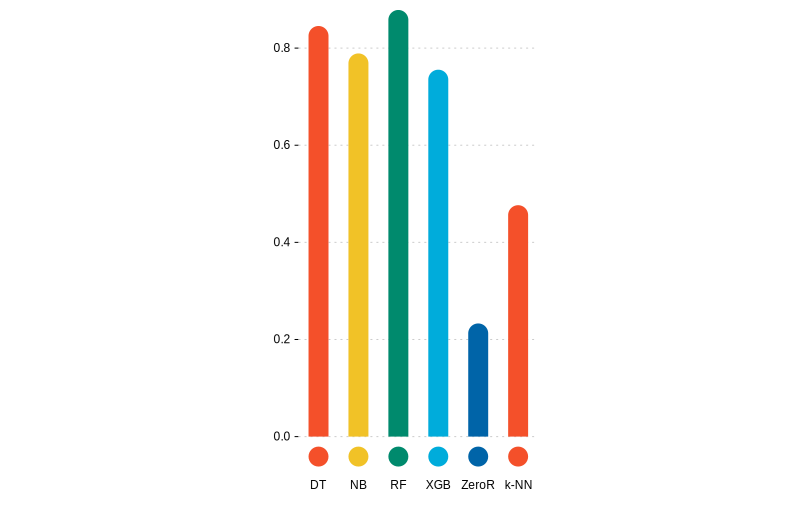
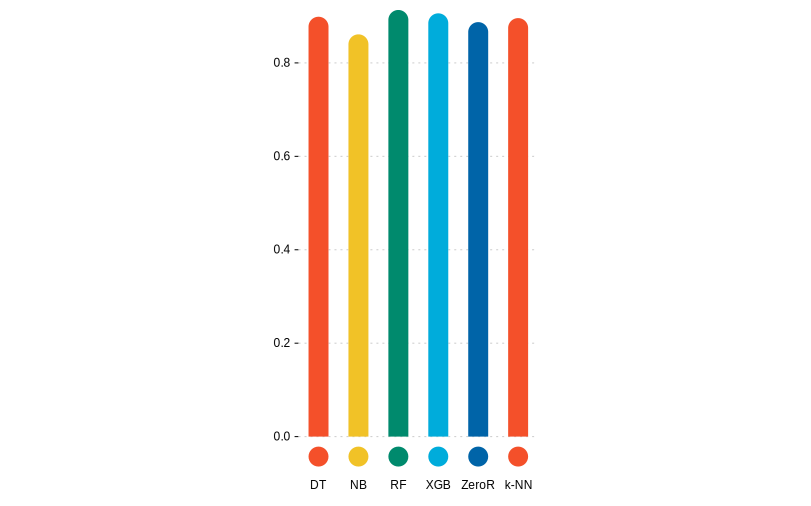
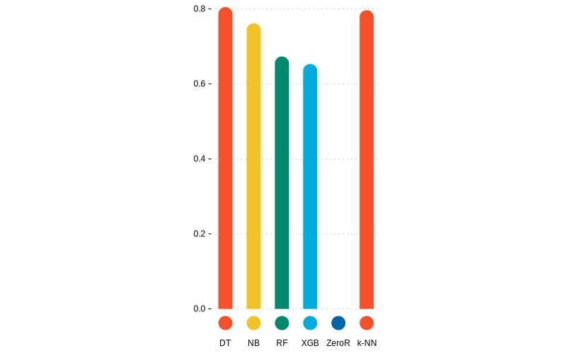

# Práctica 1: Análisis predictivo mediante clasificación

> Ana Buendía Ruiz-Azuaga

## Índice

- [Práctica 1: Análisis predictivo mediante clasificación](#práctica-1-análisis-predictivo-mediante-clasificación)
  - [Índice](#índice)
  - [Introducción](#introducción)
    - [Heart](#heart)
    - [Mobile Price](#mobile-price)
    - [Bank](#bank)
    - [Tanzania](#tanzania)
  - [Resultados obtenidos](#resultados-obtenidos)
    - [ZeroR](#zeror)
    - [Árboles de decisión (DT)](#árboles-de-decisión-dt)
    - [Random Forest (RF)](#random-forest-rf)
    - [Naive Bayes (NB)](#naive-bayes-nb)
    - [XGBoost (XGB)](#xgboost-xgb)
    - [k-NN (k-NN)](#k-nn-k-nn)
  - [Análisis de resultados](#análisis-de-resultados)
  - [Configuración de algoritmos](#configuración-de-algoritmos)
  - [Procesado de datos](#procesado-de-datos)
  - [Interpretación de resultados](#interpretación-de-resultados)
  - [Contenido adicional](#contenido-adicional)
  - [Bibliografía](#bibliografía)

## Introducción

En esta práctica se trabajará en cuatro problemas de clasificación reales mediante diversos algoritmos de clasificación supervisada implementados en knime, con el objetivo de obtener una predicción y analizar la calidad de esta comparándola con predicciones de otros algoritmos en el mismo problema.

Ahora estudiaremos las particularidades de cada problema por separado:

### Heart 

El objetivo de este problema consiste en intentar predecir si se tiene o no una enfermedad cardíaca.

Para ello, se nos proporciona un conjunto de datos con 918 instancias, de las cuales se nos da información respecto a 11 variables o atributos, y su clase a la que pertencen.

Comenzamos analizando los datos del problema, lo primero en lo que nos fijamos es en que la mayoría ed variables son numéricas, y algunos atributos están marcados con enteros usando 0 o 1 para señalar si una persona posee una característica o no. En el atributo colesterol, cabe destacar que se va a interpretar el valor 0 como valor perdido.

Representamos los datos usando una pie chart para comprobar si las clases están balanceadas o no.

Observamos que las clases están más o menos igualadas, pero no terminan de estar balanceadas.

Se ha considerado como la clase positiva el valor 1, indicando que se tiene una enfermedad cardíaca.

### Mobile Price

Este problema consiste en intentar predecir a qué rango de precio pertenece un teléfono móvil, donde hay cuatro posibles rangos.

Para ello, se nos proporciona un conjunto de datos con 2000 instancias, de las cuales se nos da información respecto a 20 variables o atributos, y su clase a la que pertencen.

Comenzamos analizando los datos del problema, lo primero en lo que nos fijamos es en que la mayoría ed variables son numéricas, y algunos atributos están marcados con enteros usando 0 o 1 para señalar si un teléfono posee o no una carcaterística, por ejemplo, si es azul o no, o si tiene 4G o no.

Representamos los datos usando una pie chart para comprobar si las clases están balanceadas o no.

Observamos que las 4 clases están igualmente representadas, por lo que el conjunto de datos está balanceado.

Finalmente comprobamos al leer el archivo de datos que el problema no tiene missing values, es decir, no hay ningún atributo que sea desconocido para alguna de las instancias.

Se ha considerado como la clase positiva el rango 0 de precio, aunque se podría haber seleccionado cualquier otro.

### Bank

El objetivo de este problema es realizar predicciones sobre si va a concenderse un crédito en un banco o no basándose en diversos factores.

Para este propósito se nos proporciona un fichero de datos que consta de 41188 instancias, de las cuales conocemos 20 atributos y la clase a la que pertencen, que será sí o no.

Analizamos ahora los datos que nos han proporcionado del problema, al contrario que en el problema de los móviles, aquí podemos observar que hay variables nominales.

Usamos una pie chart para ver a simple vista si los datos están balanceados.

Observamos que los datos están bastante desbalanceados, lo que puede afectar al rendimiento de algunos algoritmos que sean sensibles a ello.

Para terminar el análisis inicial abrimos el archivo de datos y comprobamos que hay missing values, ya que hay atributos que en ocasiones toman un valor "unknown" o "nonexistent", indicando así que son valores desconocidos o perdidos.

Se ha considerado como la clase positiva "yes", ya que queremos predecir cuándo se va a conceder un crédito.

### Tanzania

Este problema consiste en tratar de realizar predicciones sobre qué bombas de agua en Tanzania no funcionan para cambiarlas o repararlas.

Para ello, contamos con un conjunto de datos que consta de 55083 instancias, de las cuales conocemos 39 atributos y la clase a la que pertencen, que podrá tomar valores "funcional" o "no funcional".

Analizamos ahora los datos que nos han proporcionado del problema, de nuevo en este conjunto de datos tenemos atributos nominales a la vez que atributos numéricos.

Usamos una pie chart para ver a simple vista si los datos están balanceados.

Observamos que los datos están bastante desbalanceados, lo que puede afectar al rendimiento de algunos algoritmos que sean sensibles a ello.

Finalmente abrimos el archivo de datos y comprobamos que hay missing values, ya que hay atributos que en ocasiones toman un valor "unknown" o "nonexistent", o en algunos numéricos se ha consdierado el valor "0" como desconocido, indicando así que son valores desconocidos o perdidos.

Se ha considerado como la clase positiva "non functional", ya que queremos predecir cuándo se necesita reparar una bomba de agua.

## Resultados obtenidos

### ZeroR

Para comenzar, aunque no se ha considerado este algoritmo como uno de los cinco a estudiar durante la práctica, se ha implementado el algoritmo ZeroR como referencia para los demás algoritmos.

El algoritmo ZeroR predice siempre que cualquier instancia pertenece a la clase mayoritaria, por lo tanto no resulta muy útil, pero proporciona una cota inferior al resto de algoritmos, esto es, cualquier algoritmo nos debería proporcionar un valor mayor en las medidas al que nos proporciona ZeroR.

A continuación tenemos la tabla con las medidas obtenidas por este algoritmo en cada dataset:

En la siguiente tabla se muestran las medidas tomadas:

| Dataset  | TP   | FP   | TN    | FN    | Precision | Sensitivity | Specificity | F-measure | Accuracy | Cohen's kappa | Gmean  | AUC    |
| -------- | ---- | ---- | ----- | ----- | --------- | ----------- | ----------- | --------- | -------- | ------------- | ------ | ------ |
| Heart    | 508  | 410  | 0     | 0     | 0,5534    | 1,0000      | 0,0000      | 0,7125    | 0,5534   | 0,0000        | 0,0000 | 0,4819 |
| Mobile   | 188  | 612  | 888   | 312   | 0,2350    | 0,3760      | 0,5920      | 0,2892    | 0,2330   | \-0,0227      | 0,4718 | 0,4787 |
| Bank     | 0    | 0    | 36548 | 4640  |           | 0,0000      | 1,0000      |           | 0,8873   | 0,0000        | 0,0000 | 0,4892 |
| Tanzania | 0    | 0    | 32259 | 22824 |           | 0,0000      | 1,0000      |           | 0,5856   | 0,0000        | 0,0000 | 0,4974 |

Como se puede observar el algoritmo no da buenos resultados, pero como comentamos antes solo lo usaremos para tener una cota inferior en las medidas de los demás algoritmos.

También llama la atención que hay valores que no han podido calcularse en la tabla, ya que como este algroitmo siempre asigna como predicción la clase mayoritaria, algunas medidas no pueden calcularse, pues requerirían dividir por cero.

### Árboles de decisión (DT)

El primer algoritmo seleccionado son árboles de decisión, estos parten de los ejemplos en el conjunto de entrenamiento para construir un árbol seleccionando atributos con el objetivo de dividir los ejemplos en función de los valores de estos.

Como criterio de selección se ha usado el índice Gini, este índice mide con qué frecuencia si escogemos aleatoriamente un ejemplo del conjunto de datos este sería etiquetado de manera incorrecta según la distribución de clases del subconjunto.

Sea $p_i$  la frecuencia relativa de la clase $i$ en un conjunto de datos $T$, que contiene ejemplos de $n$ clases, entonces se define:
$$\displaystyle\text{gini}(T)=1-\sum_{i=1}^{n}p_i^2$$

| Dataset  | TP    | FP   | TN    | FN   | Precision | Sensitivity | Specificity | F-measure | Accuracy | Cohen's kappa | Gmean  | AUC    | Complejidad |
| -------- | ----- | ---- | ----- | ---- | --------- | ----------- | ----------- | --------- | -------- | ------------- | ------ | ------ | ----------- |
| Heart    | 417   | 87   | 323   | 90   | 0,8274    | 0,8225      | 0,7878      | 0,8249    | 0,8070   | 0,6099        | 0,8050 | 0,8086 | 69          |
| Mobile   | 452   | 40   | 1460  | 48   | 0,9187    | 0,9040      | 0,9733      | 0,9113    | 0,8455   | 0,7940        | 0,9380 | 0,9591 | 109         |
| Bank     | 2321  | 1973 | 34365 | 2158 | 0,5405    | 0,5182      | 0,9457      | 0,5291    | 0,8988   | 0,4725        | 0,7000 | 0,7508 | 2689        |
| Tanzania | 17045 | 4426 | 27655 | 5631 | 0,7939    | 0,7517      | 0,8620      | 0,7722    | 0,8163   | 0,6185        | 0,8050 | 0,8444 | 5042        |

Observamos que funcionó mejor en el dataset e los móviles, y peor en el del banco, aún así ha dado muy buenos resultados en todos los conjuntos de datos, ya que los árboles de decisión trabajan con cualquier valor de datos y gestionan bien los valores perdidos.

En este algoritmo la complejidad se corresponde con el número de hojas que tiene el árbol generado. Para calcular el número de hojas se ha empleado el siguiente workflow:

Para calcular el número de hojas se transforma el árbol obtenido en un conjunto de reglas y con el nodo Statistics se comprueba el parámetro "row count", que cuenta el número de filas, que coincide con las reglas y por tanto con las hojas.

### Random Forest (RF)

También hemos elegido el algoritmo random forest, que combina varios árboles de decisión simples para mejorar su predicción. Cada clasificador funciona independientemente de los demás, de forma que se mejora la inestabilidad de los algoritmos frente a pequeños cambios en el conjunto de datos de entrenamiento.

Se usarán 100 clasificadores que usan el índice Gini para seleccionar los atributos con los que dividir el árbol.

En algunos problemas, como en el de Tanzania, ha sido necesario usar el nodo domain calculator para que tuviera en cuenta todos los valores posibles de los atributos.

Veamos la tabla con las medidas tomadas en cada conjunto de datos:

| Dataset  | TP    | FP   | TN    | FN   | Precision | Sensitivity | Specificity | F-measure | Accuracy | Cohen's kappa | Gmean  | AUC    | Complejidad |
| -------- | ----- | ---- | ----- | ---- | --------- | ----------- | ----------- | --------- | -------- | ------------- | ------ | ------ | ----------- |
| Heart    | 455   | 71   | 339   | 53   | 0,8650    | 0,8957      | 0,8268      | 0,8801    | 0,8649   | 0,7256        | 0,8606 | 0,9225 | 100         |
| Mobile   | 471   | 43   | 1457  | 29   | 0,9163    | 0,9420      | 0,9713      | 0,9290    | 0,8785   | 0,8380        | 0,9566 | 0,9947 | 100         |
| Bank     | 2048  | 980  | 35568 | 2592 | 0,6764    | 0,4414      | 0,9732      | 0,5342    | 0,9133   | 0,4887        | 0,6554 | 0,9428 | 100         |
| Tanzania | 14060 | 8517 | 23742 | 8764 | 0,6228    | 0,6160      | 0,7360      | 0,6194    | 0,6863   | 0,3526        | 0,6733 | 0,7418 | 100         |

Podemos observar que Random Forest obtiene resultados muy buenos en todos los datos, aunque su valor más bajo sn duda está en el problema de Tanzania. En tres de los cuatro problemas a estudiar se ve que random forest es el que mejores resultados obtiene. 

En este algoritmo se considera la complejidad como el número de modelos a generar.

### Naive Bayes (NB)

Este algoritmo es el más simple de los métodos bayesianos. Se asume que todos sus atributos son independientes y calcula cuál es la clase más probable dado un valor del resto de atributos.

Para este algoritmo no ha sido necesario realizar preprocesamiento, ya que aunque obtenemos un warning, el algoritmo puede trabajar con valores perdidos.

Veamos ahora las medidas tomadas con este algoritmo:

| Dataset  | TP    | FP   | TN    | FN   | Precision | Sensitivity | Specificity | F-measure | Accuracy | Cohen's kappa | Gmean  | AUC    | Complejidad |
| -------- | ----- | ---- | ----- | ---- | --------- | ----------- | ----------- | --------- | -------- | ------------- | ------ | ------ | ----------- |
| Heart    | 436   | 75   | 335   | 72   | 0,8532    | 0,8583      | 0,8171      | 0,8557    | 0,8399   | 0,6758        | 0,8374 | 0,9152 | 22          |
| Mobile   | 436   | 67   | 1433  | 64   | 0,8668    | 0,8720      | 0,9553      | 0,8694    | 0,7890   | 0,7187        | 0,9127 | 0,9796 | 80          |
| Bank     | 2511  | 3594 | 32954 | 2129 | 0,4113    | 0,5412      | 0,9017      | 0,4674    | 0,8611   | 0,3892        | 0,6985 | 0,8336 | 40          |
| Tanzania | 16149 | 5813 | 26446 | 6675 | 0,7353    | 0,7075      | 0,8198      | 0,7212    | 0,7733   | 0,5303        | 0,7616 | 0,8489 | 117         |

Se observa que proporciona predicciones bastante buenas, en especial en los problemas con datos numéricos.

En Naive bayes la complejidad se corresponde con el número de clases multiplicada por el número de atributos que se tienen de cada instancia.

### XGBoost (XGB)

XGBoosting es una algoritmo "ensemble" basado en árboles de decisión que usa "gradient boosting".

Se ha escogido este algoritmo ya que se ha considerado que puede competir en medidas con el random forest.

Aunque XGBoosting no requiere de un preprocesamiento de los missing values, sí ha sido necesario convertir todos los atributos a nominales.

Las medidas obtenidas para este algoritmo en los distintos problemas son:

| Dataset  | TP    | FP   | TN    | FN   | Precision | Sensitivity | Specificity | F-measure | Accuracy | Cohen's kappa | Gmean  | AUC    | Complejidad |
| -------- | ----- | ---- | ----- | ---- | --------- | ----------- | ----------- | --------- | -------- | ------------- | ------ | ------ | ----------- |
| Heart    | 372   | 116  | 294   | 136  | 0,7623    | 0,7323      | 0,7171      | 0,7470    | 0,7255   | 0,4473        | 0,7246 | 0,7832 | 100         |
| Mobile   | 173   | 326  | 1174  | 327  | 0,3467    | 0,3460      | 0,7827      | 0,3463    | 0,3210   | 0,0947        | 0,5204 | 0,6109 | 100         |
| Bank     | 2174  | 1415 | 35133 | 2466 | 0,6057    | 0,4685      | 0,9613      | 0,5284    | 0,9058   | 0,4770        | 0,6711 | 0,8785 | 100         |
| Tanzania | 16536 | 4366 | 27893 | 6288 | 0,7911    | 0,7245      | 0,8647      | 0,7563    | 0,8066   | 0,5965        | 0,7915 | 0,8746 | 100         |

Al contrario que en el algoritmo anterior, XGBoosting obtiene mejores resultados en los problemas con datos nominales, ya que no acepta atributos numéricos.

Para XGBoost la complejidad es el número de rondas de boost.

### k-NN (k-NN)

El algoritmo k-NN predice las clases calculando cuáles son los $k$ vecinos más cercanos al ejemplo dado y asigna la clase mayoritaria entre ellos. Para calcular qué ejemplos son "más cercanos" se usa la distancia euclídea entre los atributos, aunque en ocasiones puede usarse otra distancia.

Como preprocesamiento mínimo han tenido que tratarse los valores perdidos o missing values, además de, como el algoritmo trabaja con distancias euclídeas, convertir todas las variables a variables numéricas. Y, finalmente, con el fin de no dar más peso a unos valores numéricos que a otros se ha normalizado.

El algoritmo se ha implementado considerando $k=3$.

Las distintas medidas obtenidas para k-NN son:

| Dataset  | TP    | FP   | TN    | FN   | Precision | Sensitivity | Specificity | F-measure | Accuracy | Cohen's kappa | Gmean  | AUC    | Complejidad |
| -------- | ----- | ---- | ----- | ---- | --------- | ----------- | ----------- | --------- | -------- | ------------- | ------ | ------ | ----------- |
| Heart    | 450   | 83   | 327   | 58   | 0,8443    | 0,8858      | 0,7976      | 0,8646    | 0,8464   | 0,6874        | 0,8405 | 0,8417 | 735         |
| Mobile   | 233   | 243  | 1257  | 267  | 0,4895    | 0,4660      | 0,8380      | 0,4775    | 0,3705   | 0,1607        | 0,6249 | 0,7451 | 1600        |
| Bank     | 1488  | 1310 | 35238 | 3152 | 0,5318    | 0,3207      | 0,9642      | 0,4001    | 0,8917   | 0,3446        | 0,5561 | 0,7517 | 32951       |
| Tanzania | 16702 | 4670 | 27589 | 6122 | 0,7815    | 0,7318      | 0,8552      | 0,7558    | 0,8041   | 0,5925        | 0,7911 | 0,8555 | 44067       |

En general, funciona bien, no se ve tanta disparidad entre el dataset para el que mejor funciona y para el que peor. 

En este algoritmo la complejidad es el conjunto de instancias de los datos de entrenamiento.

## Análisis de resultados

Para analizar correctamente los resultados obtenidos, realizaremos el análisis individualmente para cada conjunto de datos que se ha trabajado.

Realizaremos un análisis centrado en comparar los distintos algoritmos usados en cada problema, tratando de buscar motivos a por qué unos mejoran mejor que otros y finalmente extraer conclusiones.

### Heart

Para comenzar, analizamos el problema sobre enfermedades del corazón. En la siguiente tabla se pueden ver las medidas obtenidas por los diferentes algoritmos en este problema.

| Alg   | TP   | FP   | TN   | FN   | Precision | Sensitivity | Specificity | F-measure | Accuracy | Cohen's kappa | Gmean  | AUC    |
| ----- | ---- | ---- | ---- | ---- | --------- | ----------- | ----------- | --------- | -------- | ------------- | ------ | ------ |
| DT    | 417  | 87   | 323  | 90   | 0,8274    | 0,8225      | 0,7878      | 0,8249    | 0,8070   | 0,6099        | 0,8050 | 0,8086 |
| RF    | 455  | 71   | 339  | 53   | 0,8650    | 0,8957      | 0,8268      | 0,8801    | 0,8649   | 0,7256        | 0,8606 | 0,9225 |
| ZeroR | 508  | 410  | 0    | 0    | 0,5534    | 1,0000      | 0,0000      | 0,7125    | 0,5534   | 0,0000        | 0,0000 | 0,4819 |
| NB    | 436  | 75   | 335  | 72   | 0,8532    | 0,8583      | 0,8171      | 0,8557    | 0,8399   | 0,6758        | 0,8374 | 0,9152 |
| XGB   | 372  | 116  | 294  | 136  | 0,7623    | 0,7323      | 0,7171      | 0,7470    | 0,7255   | 0,4473        | 0,7246 | 0,7832 |
| k-NN  | 450  | 83   | 327  | 58   | 0,8443    | 0,8858      | 0,7976      | 0,8646    | 0,8464   | 0,6874        | 0,8405 | 0,8417 |

Para facilitar la lectura de estos datos, vamos a representar en un gráfico de barras apilado los valores de la matriz de confusión.

En esta gráfica se puede ver que el algoritmo con mayor número de verdaderos positivos es Random Forest. Además, tiene un número bastante bajo de falsos positivos, por lo que a primera vista, lo consideraríamos el mejor algroitmo para este dataset.

En general, se observa que todos los algoritmos realizan predicciones bastante buenas, aunque el peor es XGBoost. Esto puede deberse a que XGBoost trabaja solamente con variables nominales o categóricas, y el conjunto de datos del corazón tiene muchas variables relevantes numéricas. Por este mismo motivo, k-NN, que solo trabaja con variables numéricas funciona bastante bien.

Los algoritmos basados en árboles y naive bayes, al poder trabajar con variables tanto categóricas como numéricas, no parece afectarles mucho.

Veamos ahora la curva ROC:

En esta curva de nuevo se aprecia que el algoritmo random forest es el mejor, seguido de cerca por Naive Bayes y después k-NN.

También cabe destacar que en esta gráfica se aprecia como el algoritmo XGBoost es el peor de nuevo, y como el algoritmo ZeroR es ligeramente peor que un selector aleatorio.

Representamos también la precisión de cada algoritmo:

Se observa que los únicos algoritmos con precisión menor a 0.8 son ZeroR y XGBoost.

En este problema hemos notado que Naive bayes funciona bastante bien, como ya se mencionó en la seccióna nterior, este algoritmo asume que todos los atributos son independientes entre sí. Para comprobar si esta asunción es cierta, hemos representado como un heatmap la matriz de correlación.

Se puede ver que la correación entre atributos es nula o muy baja, por lo tanto la asunción de que los atributos son independientes no afecta demasiado negativamente.

Finalmente, se hará un ránking de los algoritmos en función de G-mean. Para hacer la comparación más sencilla, se realizará un gráfico de barras igual que el de la precisión.

En conclusión, el ránking es, de mejor a peor:

- Random forest.
- k-NN
- Naive bayes.
- Decission tree.
- XGBoost.

### Mobile

Analizamos ahora el conjunto de datos sobre estimaciones de precios de móviles según sus características. De nuevo, hemos tomado medidas con los distintos algoritmos:

| Alg   | TP   | FP   | TN   | FN   | Precision | Sensitivity | Specificity | F-measure | Accuracy | Cohen's kappa | Gmean  | AUC    |
| ----- | ---- | ---- | ---- | ---- | --------- | ----------- | ----------- | --------- | -------- | ------------- | ------ | ------ |
| DT    | 452  | 40   | 1460 | 48   | 0,9187    | 0,9040      | 0,9733      | 0,9113    | 0,8455   | 0,7940        | 0,9380 | 0,9591 |
| RF    | 471  | 43   | 1457 | 29   | 0,9163    | 0,9420      | 0,9713      | 0,9290    | 0,8785   | 0,8380        | 0,9566 | 0,9947 |
| ZeroR | 188  | 612  | 888  | 312  | 0,2350    | 0,3760      | 0,5920      | 0,2892    | 0,2330   | \-0,0227      | 0,4718 | 0,4787 |
| NB    | 436  | 67   | 1433 | 64   | 0,8668    | 0,8720      | 0,9553      | 0,8694    | 0,7890   | 0,7187        | 0,9127 | 0,9796 |
| XGB   | 173  | 326  | 1174 | 327  | 0,3467    | 0,3460      | 0,7827      | 0,3463    | 0,3210   | 0,0947        | 0,5204 | 0,6109 |
| k-NN  | 233  | 243  | 1257 | 267  | 0,4895    | 0,4660      | 0,8380      | 0,4775    | 0,3705   | 0,1607        | 0,6249 | 0,7451 |

Para hacer el análisis más sencillo, vamos a representar algunos de estos datos.

Comenzamos representando la matriz de confusión de cada algoritmo usando un gráfico de barras apiladas.

Lo primero que llama la atención de esta gráfica es que el algoritmo ZeroR no tiene solo positivos y falsos positivos, esto se debe a que, como vimos en la introducción al analizar los datos, todas las clases están igualmente representadas, es decir, no hay una clase mayoritaria que el algoritmo pueda seleccionar para asignar siempre.

De nuevo, el algoritmo con mayor número de verdaderos positivos y menor número de falsos positivos es el random forest, y el peor vuelve a ser XGBoost.

En este dataset se nota algo más de diferencia entre los algoritmos, y k-NN funciona peor que en el anterior, pese a que en este conjunto de datos todas las variables son numéricas. Esto puede deberse a que muchos de los atributos, pese a considerarse números enteros, realmente solo toman el valor 0 o 1 para indicar si un móvl tiene o no una característica, es decir, aunque las variables están calificadas como numéricas, realmente actúan como categóricas (sí o no).

De nuevo, los algoritmos basados en árboles y naive bayes, que trabajan con variables numéricas y nominales no tienen este problema.

Estudiamos ahora la curva ROC:

En la curva ROC de nuevo se aprecia que el mejor algoritmo es random forest, que deja la mayor área por debajo suya, seguido de naive bayes y el árbol de decisión.

También se ve claramente la diferencia que hay entre los tres mejores, ya comentados, y después k-NN y XGBoost.

De nuevo, el mal rendimiento de XGBoost puede deberse a que los atributos del conjunto de datos son numéricos y este algroitmo solo admite atributos nominales.

Representamos ahora la precisión de los distintos algoritmos:

En este caso, los únicos algoritmos con precisión mayor a 0.8 son los basados en árboles, seguidos de cerca por Naive Bayes y después por k-NN.

También llama la atención la baja precisión del XGBoost en comparación con el resto de algoritmos.

De nuevo, en este problema Naive Bayes funciona considerablemente bien, comprobamos de nuevo la matriz de correlación de los atributos del problema:

En efecto, de nuevo comprobamos que los atributos tienen poca o nula correlación entre ellos en general, luego el principal problema de naive bayes, que es suponer que losa tributos son independientes, no lo perjudica.

Finalmente, se hará un ránking de los algoritmos en función de G-mean. Para hacer la comparación más sencilla, se realizará un gráfico de barras igual que el de la precisión.

En conclusión, el ránking es, de mejor a peor:

- Random forest.
- Decission tree.
- Naive bayes.
- k-NN.
- XGBoosting.

### Bank

Pasamos a analizar ahora el conjunto de datos de un banco que quiere predecir cuándo conceder créditos o no.

Veamos de nuevo las medidas obtenidas para cada algoritmo aplicado a este conjunto de datos.

| Alg   | TP   | FP   | TN    | FN   | Precision | Sensitivity | Specificity | F-measure | Accuracy | Cohen's kappa | Gmean  | AUC    |
| ----- | ---- | ---- | ----- | ---- | --------- | ----------- | ----------- | --------- | -------- | ------------- | ------ | ------ |
| DT    | 2321 | 1973 | 34365 | 2158 | 0,5405    | 0,5182      | 0,9457      | 0,5291    | 0,8988   | 0,4725        | 0,7000 | 0,7508 |
| RF    | 2048 | 980  | 35568 | 2592 | 0,6764    | 0,4414      | 0,9732      | 0,5342    | 0,9133   | 0,4887        | 0,6554 | 0,9428 |
| ZeroR | 0    | 0    | 36548 | 4640 |           | 0,0000      | 1,0000      |           | 0,8873   | 0,0000        | 0,0000 | 0,4892 |
| NB    | 2511 | 3594 | 32954 | 2129 | 0,4113    | 0,5412      | 0,9017      | 0,4674    | 0,8611   | 0,3892        | 0,6985 | 0,8336 |
| XGB   | 2174 | 1415 | 35133 | 2466 | 0,6057    | 0,4685      | 0,9613      | 0,5284    | 0,9058   | 0,4770        | 0,6711 | 0,8785 |
| k-NN  | 1488 | 1310 | 35238 | 3152 | 0,5318    | 0,3207      | 0,9642      | 0,4001    | 0,8917   | 0,3446        | 0,5561 | 0,7517 |

Ahora vamos a visualizar como en los ejemplos anteriores estos datos, comenzando por la matriz de confusión representada en un gráfico de barras apiladas:

Lo primero a destacar de la gráfica es como la mayoría de valores son verdaderos negaitvos. Si nos fijamos en ZeroR veremos que solo predice negativos, lo cuál es congruente con el análisis inicial de los datos, en el que se veían muy desbalanceados, y con la clase predominante no.

Nosotros hemos considerado la clase positiva como sí, por lo tanto la gráfica tiene sentido, ya que indica que predominan los valores negativos, que son la clase no.

El algoritmo que mayor número de verdaderos positivos proporciona es naive bayes, pero también predice muchos falsos positivos, lo que puede ser peligroso para un banco que quiera saber cuándo conceder un préstamo. Teniendo esto en cuenta, los algoritmos que nos llaman la atención son random forest, XGBoosting y decission tree.

Estudiamos ahora la curva ROC:

En la curva ROC se observa de nuevo que el mejor algoritmo es random forest, seguido de XGBoosting, como ya se pudo observar en la gráfica anterior.

El tercer mejor algoritmo es naive bayes, después decission tree y por último k-NN.

De nuevo, al haber atributos nominales el algoritmo k-NN parece funcionar bastante peor que en los datasets anteriores, ya que solo admite variables numéricas y por tanto se deben transformar aquellas que no lo sean.

Representamos finalmente la precisión de todos los algoritmos:

Lo primero que nos llama la atención de este gráfico es como todos los algoritmos tienen una precisión mayor que 0.8.

A la vista de todos los gráficos y los datos obtenidos, random forest parece ser el mejor algoritmo, seguido de XGBoosting y árboles de decisión.

También se refleja en este gráfico de barras como naive bayes predice más falsos positivos, ya que es el algoritmo con menor precisión de todos.

Por otro lado, se observa que XGBoosting ahora es un algoritmo bastante bueno, ya que la mayoría de variables son nominales o categóricas.

Representamos finalmente la matriz de correlaciones de los atributos del conjunto de datos:

Se puede ver que la correlación entre los distintos atributos es más alta que en los otros conjuntos de datos, lo que ha podido afectar al rendimiento de Naive Bayes al asumir que son independientes.

Finalmente, se hará un ránking de los algoritmos en función de G-mean. Para hacer la comparación más sencilla, se realizará un gráfico de barras igual que el de la precisión.

En conclusión, el ránking es, de mejor a peor:

- Decission tree.
- Naive Bayes.
- XGBoosting.
- Random forest.
- k-NN.

### Tanzania

Por último, analizamos el problema de las bombas de agua en Tanzania, cuyo objetivo es tratar de predecir qué bombas se han roto para repararlas. Por ello, se ha considerado la clase positiva nonfunctional.

Las medidas obtenidas para cada uno de los algoritmos son:

| Alg   | TP    | FP   | TN    | FN    | Precision | Sensitivity | Specificity | F-measure | Accuracy | Cohen's kappa | Gmean  | AUC    |
| ----- | ----- | ---- | ----- | ----- | --------- | ----------- | ----------- | --------- | -------- | ------------- | ------ | ------ |
| DT    | 17045 | 4426 | 27655 | 5631  | 0,7939    | 0,7517      | 0,8620      | 0,7722    | 0,8163   | 0,6185        | 0,8050 | 0,8444 |
| RF    | 14060 | 8517 | 23742 | 8764  | 0,6228    | 0,6160      | 0,7360      | 0,6194    | 0,6863   | 0,3526        | 0,6733 | 0,7418 |
| ZeroR | 0     | 0    | 32259 | 22824 |           | 0,0000      | 1,0000      |           | 0,5856   | 0,0000        | 0,0000 | 0,4974 |
| NB    | 16149 | 5813 | 26446 | 6675  | 0,7353    | 0,7075      | 0,8198      | 0,7212    | 0,7733   | 0,5303        | 0,7616 | 0,8489 |
| XGB   | 16536 | 4366 | 27893 | 6288  | 0,7911    | 0,7245      | 0,8647      | 0,7563    | 0,8066   | 0,5965        | 0,7915 | 0,8746 |
| k-NN  | 16702 | 4670 | 27589 | 6122  | 0,7815    | 0,7318      | 0,8552      | 0,7558    | 0,8041   | 0,5925        | 0,7911 | 0,8555 |

Visualizamos la matriz de confusión mediante el gráfico de barras apiladas, como en los casos anteriores:

Lo primero que destacamos es que, como en el ejemplo anterior, la clase mayoritaria es la considerada negativa, lo que se refleja en el algoritmo ZeroR, que asigna a todos los ejemplos esta clase.

El algoritmo con mayor número de verdaderos positivos es los árboles de decisión, aunque destaca que todos los algoritmos producen resultados similares de verdaderos positivos. El algoritmo que peor funciona es random forest, que predice menos verdaderos positivos y más falsos positivos que el resto de algoritmos probados.

Para analizar mejor las diferencias entre los algoritmos analizamos ahora ala curva ROC:

En la curva ROC se aprecia que el mejor algoritmo es XGBoosting, seguido por k-NN.

Se observa también que la diferencia entre los árboles de decisión y naive bayes es mínima, por lo que para analizar más fácilmente qué algoritmo realiza mejores predicciones nos apoyaremos en el resto de datos.

Finalmente, cabe destacar que Random Forest sigue siendo el peor algoritmo con bastante diferencia respecto a los demás.

Representamos ahora la precisión de cada uno:

Los únicos tres algoritmos que alcanzan la precisión de 0.8 son árboles de decisión, XGBoosting y k-NN. En precisión se aprecia que XGBoosting es ligeramente mejor, por una diferencia ínfima.

De nuevo, la precisión de random forest es la más baja y naive bayes no destaca.

Analizamos ahora la matriz de correlaciones de los atributos:

Se aprecia que en general no hay correlación entre los atributos, aunque abajo a la derecha hay una sección bastante grande con bastante correlación entre ellos, lo que puede afectar a naive bayes.

Finalmente, se hará un ránking de los algoritmos en función de G-mean. Para hacer la comparación más sencilla, se realizará un gráfico de barras igual que el de la precisión.

En conclusión, el ránking es, de mejor a peor:

- Decission tree.
- XGBoosting.
- k-NN.
- Naive bayes.
- Random forest.

### Los algoritmos

Basándonos en el estudio realizado para cada dataset, vamos ahora a analizar qué algoritmos son mejores según distintas casuísticas y cuándo será conveniente usar unos u otros.

Vamos a asignar a cada algoritmo 5, 4, 3, 2 y 1 puntos según su posición en los ránkings de cada dataset, se sumarán los puntos y se hará la media para ver la clasificación en general.

Así, el ránking final es:

- Decission tree.
- Random forest.
- Naive Bayes.
- k-NN.
- XGBoosting.

Se aprecia entonces que según este criterio, los algoritmos basados en árboles son los que mejor funcionan, lo que parece razonable, ya que admiten todo tipo de atributos, tanto numéricos como categóricos y pueden trabajar con missing values.

El tercer mejor algoritmo es Naive bayes, que tampoco requiere que los datos con los que se va a trabajar sean de un tipo determinado y admite también valores perdidos, pero asume que todos los atributos son independientes entre sí, lo cuál ya hemos comprobado que no es cierto.

Finalmente los últimos algoritmos tienen restricciones del tipo de datos, ya que k-NN requiere que todos sean numéricos y XGBoost solo trabaja con nominales.

En general, se ha comprobado que XGBoost no realiza buenos predicciones para los conjuntos de datos con muchos atributos numéricos, lo cuál se ha reflejado en la clasificación ya que la mitad de los conjutnos que se han estudiado tenían principalmente atributos no nominales, pero al trabajar con atributos categóricos el algoritmo consigue buenos resultados.

Así mismo, se comprueba que k-NN también se ve afectado si hay muchos atributos nominales con los que trabajar, en especial si tienen muchas claves distintas, ya que causa problemas al convertirlo a atributos numéricos.

En general, el algoritmo que mejor parece realizar predicciones es árboles de decisión para cualquier conjunto de datos, seguido de random forest.

Naive bayes mejora a random forest al realizar predicciones en algunos conjuntos de datos y tarda menos tiempo en ejecutarse, por lo que si se comprueba la matriz de correlación entre los atributos para ver si la asunción de independencia entre ellos es razonable, puede ser mejor opción a random forest dependiendo de los datos.

## Configuración de algoritmos

## Procesado de datos

## Interpretación de resultados

## Contenido adicional

## Bibliografía

