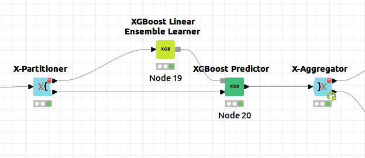
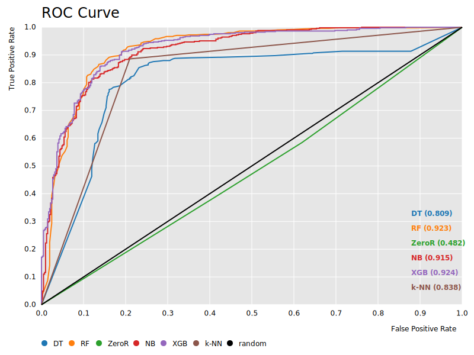

# Práctica 1: Análisis predictivo mediante clasificación

> Ana Buendía Ruiz-Azuaga

## Índice

- [Práctica 1: Análisis predictivo mediante clasificación](#práctica-1-análisis-predictivo-mediante-clasificación)
  - [Índice](#índice)
  - [Introducción](#introducción)
    - [Heart](#heart)
    - [Mobile Price](#mobile-price)
    - [Bank](#bank)
    - [Tanzania](#tanzania)
  - [Resultados obtenidos](#resultados-obtenidos)
    - [ZeroR](#zeror)
    - [Árboles de decisión (DT)](#árboles-de-decisión-dt)
    - [Random Forest (RF)](#random-forest-rf)
    - [Naive Bayes (NB)](#naive-bayes-nb)
    - [XGBoost (XGB)](#xgboost-xgb)
    - [k-NN (k-NN)](#k-nn-k-nn)
  - [Análisis de resultados](#análisis-de-resultados)
  - [Configuración de algoritmos](#configuración-de-algoritmos)
  - [Procesado de datos](#procesado-de-datos)
  - [Interpretación de resultados](#interpretación-de-resultados)
  - [Contenido adicional](#contenido-adicional)
  - [Bibliografía](#bibliografía)

## Introducción

En esta práctica se trabajará en cuatro problemas de clasificación reales mediante diversos algoritmos de clasificación supervisada implementados en knime, con el objetivo de obtener una predicción y analizar la calidad de esta comparándola con predicciones de otros algoritmos en el mismo problema.

Ahora estudiaremos las particularidades de cada problema por separado:

### Heart 

El objetivo de este problema consiste en intentar predecir si se tiene o no una enfermedad cardíaca.

Para ello, se nos proporciona un conjunto de datos con 918 instancias, de las cuales se nos da información respecto a 11 variables o atributos, y su clase a la que pertencen.

Comenzamos analizando los datos del problema, lo primero en lo que nos fijamos es en que la mayoría ed variables son numéricas, y algunos atributos están marcados con enteros usando 0 o 1 para señalar si una persona posee una característica o no. En el atributo colesterol, cabe destacar que se va a interpretar el valor 0 como valor perdido.

Representamos los datos usando una pie chart para comprobar si las clases están balanceadas o no.

Observamos que las clases están más o menos igualadas, pero no terminan de estar balanceadas.

Se ha considerado como la clase positiva el valor 1, indicando que se tiene una enfermedad cardíaca.

### Mobile Price

Este problema consiste en intentar predecir a qué rango de precio pertenece un teléfono móvil, donde hay cuatro posibles rangos.

Para ello, se nos proporciona un conjunto de datos con 2000 instancias, de las cuales se nos da información respecto a 20 variables o atributos, y su clase a la que pertencen.

Comenzamos analizando los datos del problema, lo primero en lo que nos fijamos es en que la mayoría ed variables son numéricas, y algunos atributos están marcados con enteros usando 0 o 1 para señalar si un teléfono posee o no una carcaterística, por ejemplo, si es azul o no, o si tiene 4G o no.

Representamos los datos usando una pie chart para comprobar si las clases están balanceadas o no.

Observamos que las 4 clases están igualmente representadas, por lo que el conjunto de datos está balanceado.

Finalmente comprobamos al leer el archivo de datos que el problema no tiene missing values, es decir, no hay ningún atributo que sea desconocido para alguna de las instancias.

Se ha considerado como la clase positiva el rango 0 de precio, aunque se podría haber seleccionado cualquier otro.

### Bank

El objetivo de este problema es realizar predicciones sobre si va a concenderse un crédito en un banco o no basándose en diversos factores.

Para este propósito se nos proporciona un fichero de datos que consta de 41188 instancias, de las cuales conocemos 20 atributos y la clase a la que pertencen, que será sí o no.

Analizamos ahora los datos que nos han proporcionado del problema, al contrario que en el problema de los móviles, aquí podemos observar que hay variables nominales.

Usamos una pie chart para ver a simple vista si los datos están balanceados.

Observamos que los datos están bastante desbalanceados, lo que puede afectar al rendimiento de algunos algoritmos que sean sensibles a ello.

Para terminar el análisis inicial abrimos el archivo de datos y comprobamos que hay missing values, ya que hay atributos que en ocasiones toman un valor "unknown" o "nonexistent", indicando así que son valores desconocidos o perdidos.

Se ha considerado como la clase positiva "yes", ya que queremos predecir cuándo se va a conceder un crédito.

### Tanzania

Este problema consiste en tratar de realizar predicciones sobre qué bombas de agua en Tanzania no funcionan para cambiarlas o repararlas.

Para ello, contamos con un conjunto de datos que consta de 55083 instancias, de las cuales conocemos 39 atributos y la clase a la que pertencen, que podrá tomar valores "funcional" o "no funcional".

Analizamos ahora los datos que nos han proporcionado del problema, de nuevo en este conjunto de datos tenemos atributos nominales a la vez que atributos numéricos.

Usamos una pie chart para ver a simple vista si los datos están balanceados.

Observamos que los datos están bastante desbalanceados, lo que puede afectar al rendimiento de algunos algoritmos que sean sensibles a ello.

Finalmente abrimos el archivo de datos y comprobamos que hay missing values, ya que hay atributos que en ocasiones toman un valor "unknown" o "nonexistent", o en algunos numéricos se ha consdierado el valor "0" como desconocido, indicando así que son valores desconocidos o perdidos.

Se ha considerado como la clase positiva "non functional", ya que queremos predecir cuándo se necesita reparar una bomba de agua.

## Resultados obtenidos

### ZeroR

Para comenzar, aunque no se ha considerado este algoritmo como uno de los cinco a estudiar durante la práctica, se ha implementado el algoritmo ZeroR como referencia para los demás algoritmos.

El algoritmo ZeroR predice siempre que cualquier instancia pertenece a la clase mayoritaria, por lo tanto no resulta muy útil, pero proporciona una cota inferior al resto de algoritmos, esto es, cualquier algoritmo nos debería proporcionar un valor mayor en las medidas al que nos proporciona ZeroR.

A continuación tenemos la tabla con las medidas obtenidas por este algoritmo en cada dataset:

En la siguiente tabla se muestran las medidas tomadas:
| RowID    | TruePositives | FalsePositives | TrueNegatives | FalseNegatives | Precision         | Sensitivity | Specificity | F-measure         | Accuracy          | Cohen's kappa       | Gmean             | Area Under Curve  |
| -------- | ------------- | -------------- | ------------- | -------------- | ----------------- | ----------- | ----------- | ----------------- | ----------------- | ------------------- | ----------------- | ----------------- |
| Heart    | 508           | 410            | 0             | 0              | 0,553376906318083 | 1           | 0           | 0,712482468443198 | 0,553376906318083 | 0                   | 0                 | 0,481904167466871 |
| Mobile   | 188           | 612            | 888           | 312            | 0,235             | 0,376       | 0,592       | 0,289230769230769 | 0,233             | \-0,022666666666667 | 0,471796566329175 | 0,478666666666667 |
| Bank     | 0             | 0              | 36548         | 4640           |                   | 0           | 1           |                   | 0,887345828882199 | 0                   | 0                 | 0,489205288722813 |
| Tanzania | 0             | 0              | 32259         | 22824          |                   | 0           | 1           |                   | 0,585643483470399 | 0                   | 0                 | 0,497372780689009 |

Como se puede observar el algoritmo no da buenos resultados, pero como comentamos antes solo lo usaremos para tener una cota inferior en las medidas de los demás algoritmos.

También llama la atención que hay valores que no han podido calcularse en la tabla, ya que como este algroitmo siempre asigna como predicción la clase mayoritaria, algunas medidas no pueden calcularse, pues requerirían dividir por cero.

### Árboles de decisión (DT)

El primer algoritmo seleccionado son árboles de decisión, estos parten de los ejemplos en el conjunto de entrenamiento para construir un árbol seleccionando atributos con el objetivo de dividir los ejemplos en función de los valores de estos.

Como criterio de selección se ha usado el índice Gini, este índice mide con qué frecuencia si escogemos aleatoriamente un ejemplo del conjunto de datos este sería etiquetado de manera incorrecta según la distribución de clases del subconjunto.

Sea $p_i$  la frecuencia relativa de la clase $i$ en un conjunto de datos $T$, que contiene ejemplos de $n$ clases, entonces se define:
$$\displaystyle\text{gini}(T)=1-\sum_{i=1}^{n}p_i^2$$

| Dataset  | TruePositives | FalsePositives | TrueNegatives | FalseNegatives | Precision         | Sensitivity       | Specificity       | F-measure         | Accuracy          | Cohen's kappa     | Gmean             | Area Under Curve  |
| -------- | ------------- | -------------- | ------------- | -------------- | ----------------- | ----------------- | ----------------- | ----------------- | ----------------- | ----------------- | ----------------- | ----------------- |
| Heart    | 417           | 87             | 323           | 90             | 0,827380952380952 | 0,822485207100592 | 0,787804878048781 | 0,824925816023739 | 0,806979280261723 | 0,609863207309071 | 0,804958295986076 | 0,808647013635491 |
| Mobile   | 452           | 40             | 1460          | 48             | 0,91869918699187  | 0,904             | 0,973333333333333 | 0,911290322580645 | 0,8455            | 0,794             | 0,938026296717386 | 0,959101333333333 |
| Bank     | 2321          | 1973           | 34365         | 2158           | 0,54052165812762  | 0,518196025898638 | 0,94570422147614  | 0,529123446939473 | 0,898792169929196 | 0,472454694740885 | 0,700042976712503 | 0,75078890703015  |
| Tanzania | 17045         | 4426           | 27655         | 5631           | 0,793861487587909 | 0,751675780560946 | 0,86203671955363  | 0,772192900989875 | 0,816333984696021 | 0,618530453487015 | 0,804967157120507 | 0,844448399600512 |

Observamos que funcionó mejor en el dataset e los móviles, y peor en el del banco, aún así ha dado muy buenos resultados en todos los conjuntos de datos, ya que los árboles de decisión trabajan con cualquier valor de datos y gestionan bien los valores perdidos.

### Random Forest (RF)

También hemos elegido el algoritmo random forest, que combina varios árboles de decisión simples para mejorar su predicción. Cada clasificador funciona independientemente de los demás, de forma que se mejora la inestabilidad de los algoritmos frente a pequeños cambios en el conjunto de datos de entrenamiento.

Se usarán 100 clasificadores que usan el índice Gini para seleccionar los atributos con los que dividir el árbol.

En algunos problemas, como en el de Tanzania, ha sido necesario usar el nodo domain calculator para que tuviera en cuenta todos los valores posibles de los atributos.

Veamos la tabla con las medidas tomadas en cada conjunto de datos:

| RowID    | TruePositives | FalsePositives | TrueNegatives | FalseNegatives | Precision         | Sensitivity       | Specificity       | F-measure         | Accuracy          | Cohen's kappa     | Gmean             | Area Under Curve  |
| -------- | ------------- | -------------- | ------------- | -------------- | ----------------- | ----------------- | ----------------- | ----------------- | ----------------- | ----------------- | ----------------- | ----------------- |
| Heart    | 455           | 71             | 339           | 53             | 0,865019011406844 | 0,895669291338582 | 0,826829268292683 | 0,880077369439072 | 0,864923747276688 | 0,725571124118844 | 0,860561203395613 | 0,922532168235068 |
| Mobile   | 471           | 43             | 1457          | 29             | 0,916342412451362 | 0,942             | 0,971333333333333 | 0,928994082840236 | 0,8785            | 0,838             | 0,95655423264967  | 0,99474           |
| Bank     | 2048          | 980            | 35568         | 2592           | 0,676354029062087 | 0,441379310344828 | 0,973185947247455 | 0,534167970787689 | 0,913275711372244 | 0,488674566783753 | 0,655396171970328 | 0,942780647108385 |
| Tanzania | 14060         | 8517           | 23742         | 8764           | 0,622757673738761 | 0,616018226428321 | 0,73598065656096  | 0,619369617409308 | 0,686273441896774 | 0,352556833062971 | 0,673333126127204 | 0,741831872697634 |

Podemos observar que Random Forest obtiene resultados muy buenos en todos los datos, aunque su valor más bajo sn duda está en el problema de Tanzania. En tres de los cuatro problemas a estudiar se ve que random forest es el que mejores resultados obtiene. 

### Naive Bayes (NB)

Este algoritmo es el más simple de los métodos bayesianos. Se asume que todos sus atributos son independientes y calcula cuál es la clase más probable dado un valor del resto de atributos.

Para este algoritmo no ha sido necesario realizar preprocesamiento, ya que aunque obtenemos un warning, el algoritmo puede trabajar con valores perdidos.

Veamos ahora las medidas tomadas con este algoritmo:

| RowID    | TruePositives | FalsePositives | TrueNegatives | FalseNegatives | Precision         | Sensitivity       | Specificity       | F-measure         | Accuracy          | Cohen's kappa     | Gmean             | Area Under Curve  |
| -------- | ------------- | -------------- | ------------- | -------------- | ----------------- | ----------------- | ----------------- | ----------------- | ----------------- | ----------------- | ----------------- | ----------------- |
| Heart    | 436           | 75             | 335           | 72             | 0,853228962818004 | 0,858267716535433 | 0,817073170731707 | 0,855740922473013 | 0,839869281045752 | 0,675817866460388 | 0,837417174702232 | 0,91519589014788  |
| Mobile   | 436           | 67             | 1433          | 64             | 0,866799204771372 | 0,872             | 0,955333333333333 | 0,869391824526421 | 0,789             | 0,718666666666667 | 0,912716093134479 | 0,979565333333335 |
| Bank     | 2511          | 3594           | 32954         | 2129           | 0,411302211302211 | 0,541163793103448 | 0,90166356572179  | 0,467380176826431 | 0,861051762649315 | 0,389187839485958 | 0,698532515584768 | 0,833570018218757 |
| Tanzania | 16149         | 5813           | 26446         | 6675           | 0,735315545032328 | 0,70754468980021  | 0,819802225735454 | 0,721162863394811 | 0,77328758419113  | 0,530275637811701 | 0,761607977574758 | 0,84888718795856  |

Se observa que proporciona predicciones bastante buenas, en especial en los problemas con datos numéricos.

### XGBoost (XGB)

XGBoosting es una algoritmo "ensemble" basado en árboles de decisión que usa "gradient boosting".

Se ha escogido este algoritmo ya que se ha considerado que puede competir en medidas con el random forest.

Aunque XGBoosting no requiere de un preprocesamiento de los missing values, sí ha sido necesario convertir todos los atributos a nominales.

Las medidas obtenidas para este algoritmo en los distintos problemas son:

| RowID    | TruePositives | FalsePositives | TrueNegatives | FalseNegatives | Precision         | Sensitivity       | Specificity       | F-measure         | Accuracy          | Cohen's kappa     | Gmean             | Area Under Curve  |
| -------- | ------------- | -------------- | ------------- | -------------- | ----------------- | ----------------- | ----------------- | ----------------- | ----------------- | ----------------- | ----------------- | ----------------- |
| Heart    | 372           | 116            | 294           | 136            | 0,762295081967213 | 0,732283464566929 | 0,717073170731707 | 0,746987951807229 | 0,725490196078431 | 0,447252222116028 | 0,724638410389214 | 0,783181294411372 |
| Mobile   | 173           | 326            | 1174          | 327            | 0,346693386773547 | 0,346             | 0,782666666666667 | 0,346346346346346 | 0,321             | 0,094666666666667 | 0,52038703545214  | 0,610853333333334 |
| Bank     | 2174          | 1415           | 35133         | 2466           | 0,605739760378936 | 0,468534482758621 | 0,961283791178724 | 0,528375258233078 | 0,905773526269787 | 0,476980142782518 | 0,671114449169566 | 0,878503877045856 |
| Tanzania | 16536         | 4366           | 27893         | 6288           | 0,791120466940963 | 0,724500525762355 | 0,864657924920177 | 0,756346338562869 | 0,806582793239293 | 0,596504200607112 | 0,791482862233451 | 0,874645775103436 |

Al contrario que en el algoritmo anterior, XGBoosting obtiene mejores resultados en los problemas con datos nominales, ya que no acepta atributos numéricos.

### k-NN (k-NN)

El algoritmo k-NN predice las clases calculando cuáles son los $k$ vecinos más cercanos al ejemplo dado y asigna la clase mayoritaria entre ellos. Para calcular qué ejemplos son "más cercanos" se usa la distancia euclídea entre los atributos, aunque en ocasiones puede usarse otra distancia.

Como preprocesamiento mínimo han tenido que tratarse los valores perdidos o missing values, además de, como el algoritmo trabaja con distancias euclídeas, convertir todas las variables a variables numéricas. Y, finalmente, con el fin de no dar más peso a unos valores numéricos que a otros se ha normalizado.

El algoritmo se ha implementado considerando $k=3$.

Las distintas medidas obtenidas para k-NN son:

| RowID    | TruePositives | FalsePositives | TrueNegatives | FalseNegatives | Precision         | Sensitivity       | Specificity       | F-measure         | Accuracy          | Cohen's kappa     | Gmean             | Area Under Curve  |
| -------- | ------------- | -------------- | ------------- | -------------- | ----------------- | ----------------- | ----------------- | ----------------- | ----------------- | ----------------- | ----------------- | ----------------- |
| Heart    | 450           | 83             | 327           | 58             | 0,844277673545966 | 0,885826771653543 | 0,797560975609756 | 0,864553314121037 | 0,84640522875817  | 0,687430875854242 | 0,840536057656803 | 0,84169387363165  |
| Mobile   | 233           | 243            | 1257          | 267            | 0,489495798319328 | 0,466             | 0,838             | 0,477459016393443 | 0,3705            | 0,160666666666667 | 0,624906392990182 | 0,745064666666667 |
| Bank     | 233           | 243            | 1257          | 267            | 0,489495798319328 | 0,466             | 0,838             | 0,477459016393443 | 0,3705            | 0,160666666666667 | 0,624906392990182 | 0,745064666666667 |
| Tanzania | 16702         | 4670           | 27589         | 6122           | 0,781489799737975 | 0,731773571678934 | 0,855234198208252 | 0,755815005882885 | 0,804077483071002 | 0,592520147859203 | 0,791099098624706 | 0,855471713336612 |

En general, funciona bien, no se ve tanta disparidad entre el dataset para el que mejor funciona y para el que peor. 

## Análisis de resultados

Para analizar correctamente los resultados obtenidos, realizaremos el análisis individualmente para cada conjunto de datos que se ha trabajado.

Realizaremos un análisis centrado en comparar los distintos algoritmos usados en cada problema, tratando de buscar motivos a por qué unos mejoran mejor que otros y finalmente extraer conclusiones.

### Heart

Para comenzar, analizamos el problema sobre enfermedades del corazón. En la siguiente tavbla se pueden ver las medidas obtenidas por los diferentes algoritmos en este problema.

| RowID | TruePositives | FalsePositives | TrueNegatives | FalseNegatives | Precision | Sensitivity | Specificity | F-measure | Accuracy | Cohen's kappa | Gmean  | Area Under Curve |
| ----- | ------------- | -------------- | ------------- | -------------- | --------- | ----------- | ----------- | --------- | -------- | ------------- | ------ | ---------------- |
| DT    | 417           | 87             | 323           | 90             | 0,8274    | 0,8225      | 0,7878      | 0,8249    | 0,8070   | 0,6099        | 0,8050 | 0,8086           |
| RF    | 455           | 71             | 339           | 53             | 0,8650    | 0,8957      | 0,8268      | 0,8801    | 0,8649   | 0,7256        | 0,8606 | 0,9225           |
| ZeroR | 508           | 410            | 0             | 0              | 0,5534    | 1,0000      | 0,0000      | 0,7125    | 0,5534   | 0,0000        | 0,0000 | 0,4819           |
| NB    | 436           | 75             | 335           | 72             | 0,8532    | 0,8583      | 0,8171      | 0,8557    | 0,8399   | 0,6758        | 0,8374 | 0,9152           |
| XGB   | 372           | 116            | 294           | 136            | 0,7623    | 0,7323      | 0,7171      | 0,7470    | 0,7255   | 0,4473        | 0,7246 | 0,7832           |
| k-NN  | 450           | 83             | 327           | 58             | 0,8443    | 0,8858      | 0,7976      | 0,8646    | 0,8464   | 0,6874        | 0,8405 | 0,8417           |

Para facilitar la lectura de estos datos, vamos a representar en un gráfico de barras apilado los valores de la matriz de confusión.

En esta gráfica se puede ver que el algoritmo con mayor número de verdaderos positivos es Random Forest. Además, tiene un número bastante bajo de falsos positivos, por lo que a primera vista, lo consideraríamos el mejor algroitmo para este dataset.

En general, se observa que todos los algoritmos realizan predicciones bastante buenas, aunque el peor es XGBoost. Esto puede deberse a que XGBoost trabaja solamente con variables nominales o categóricas, y el conjunto de datos del corazón tiene muchas variables relevantes numéricas. Por este mismo motivo, k-NN, que solo trabaja con variables numéricas funciona bastante bien.

Los algoritmos basados en árboles y naive bayes, al poder trabajar con variables tanto categóricas como numéricas, no parece afectarles mucho.

Veamos ahora la curva ROC:

En esta curva de nuevo se aprecia que el algoritmo random forest es el mejor, seguido de cerca por Naive Bayes y después k-NN.

También cabe destacar que en esta gráfica se aprecia como el algoritmo XGBoost es el peor de nuevo, y como el algoritmo ZeroR es ligeramente peor que un selector aleatorio.

Representamos también la precisión de cada algoritmo:

Se observa que los únicos algoritmos con precisión menor a 0.8 son ZeroR y XGBoost.

En este problema hemos notado que Naive bayes funciona bastante bien, como ya se mencionó en la seccióna nterior, este algoritmo asume que todos los atributos son independientes entre sí. Para comprobar si esta asunción es cierta, hemos representado como un heatmap la matriz de correlación.

Se puede ver que la correación entre atributos es nula o muy baja, por lo tanto la asunción de que los atributos son independientes no afecta demasiado negativamente.

En conclusión, los algoritmos que mejor han funcionado en este conjunto de datos, de mejor a peor son:

- Random forest
- Naive bayes
- k-NN
- Decission tree
- XGBoost

### Mobile

### Bank

### Tanzania

## Configuración de algoritmos

## Procesado de datos

## Interpretación de resultados

## Contenido adicional

## Bibliografía

